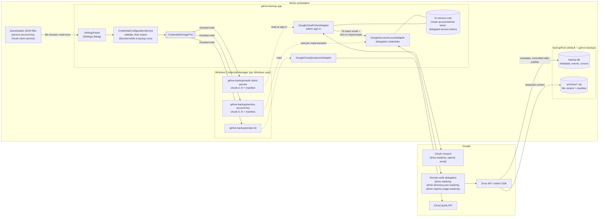
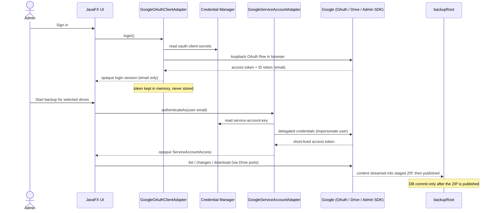
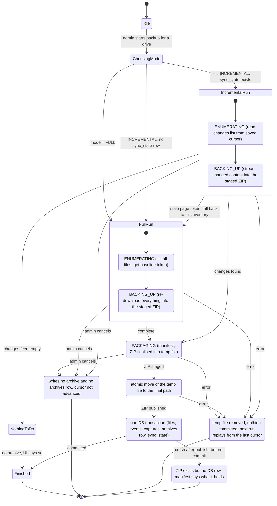
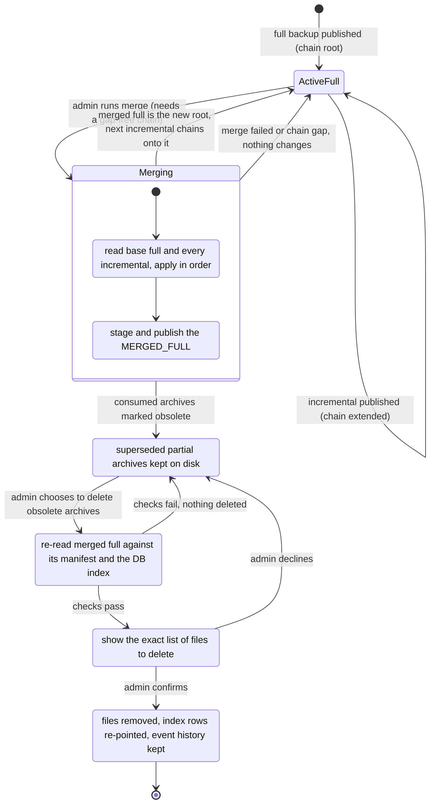

# Google Workspace Drive Backup — Windows Desktop App

## Project overview

A Windows desktop application that backs up **Google Drive data (My Drive + Shared
Drives) for every user in a non-profit Google Workspace organization**, with a
full-plus-incremental archive history and an admin-facing UI to preview and
trigger backups.

The organization runs this periodically against **external hard drives**, not a
paid cloud-backup service — a non-profit budget constraint, not an arbitrary
choice, and one with real consequences (a drive may be unplugged, swapped, or
absent between runs; see Known limitations).

**Programmatic restore is out of scope for this phase** and is planned as a
later initiative. The supported recovery path is manual: a full archive is a
Drive-shaped folder tree the admin can upload directly to a new Drive, trading
away file history for a usable copy (see **Archive output**).

Target stack: **Java + Spring Boot** (backend/service layer), **JavaFX** (UI),
**SQLite** (local state/history), packaged as a self-contained Windows app-image via
`jpackage`.

Scheduled unattended backups are out of scope: every backup is started manually
by the admin.

This document holds the requirements. Implementation status, priorities and
build order live in [plan.md](plan.md).

---

## Core requirements (confirmed)

- **Scope**: back up Drive data for *every user in the organization*, not just one
  account — requires admin-level access.
- **Drive selection**: the admin chooses which drive(s) a backup job covers —
  the user's personal drive, one or more specific Shared Drives, or a
  combination — rather than a job always covering every drive automatically.
  The selection applies to the backup job and must be visible before it starts.
- **Google-native files** (Docs/Sheets/Slides): exported to Office formats
  (`.docx` / `.xlsx` / `.pptx`), not kept in native Google format.
- **Storage**: local disk only — specifically **external hard drives** connected
  to the admin's machine, not NAS or cloud, driven by the non-profit
  organization's budget (no NAS/cloud target for v1).
- **Backup root location**: the admin chooses **one** local destination folder
  at runtime — `backupRoot` — that is the root for everything the app writes:
  the SQLite database (`backupRoot/backup.db`), the archive output
  (`backupRoot/archives/...`), and nothing else — content is never staged
  as loose files or folders (see **Storage layout**). There is no separate database-location
  picker; the database always lives inside the chosen root, so the chain
  metadata and the archives it describes can never be pointed at different
  places by the UI. The application validates that the root is writable and
  makes clear when switching roots selects a different backup history.
  Keeping the root intact as a single unit — e.g. when copying or moving it to
  a different folder or drive — **is the administrator's responsibility**: the
  app does not detect or warn if the database and the archives it references
  are later pulled apart (for example, by moving only part of the tree), and
  paths recorded in the database are stored **relative to `backupRoot`**
  precisely so that moving the whole root elsewhere needs no database changes.
- **Revision mode is fixed per chain, and only one mode is built.** Every scope
  (a personal drive or a Shared Drive) has its own **backup chain**: an ordered
  sequence of archives rooted in one full backup, followed by zero or more
  incremental backups and any merged archives produced later. A chain's
  revision mode — `LATEST_ONLY` or a future `ALL_REVISIONS` — is chosen once,
  when the chain's full backup runs, and fixed for every archive added to that
  chain afterward. **`LATEST_ONLY` is the only mode implemented**: it never
  calls Drive's `revisions.list`, and each archive holds exactly the current
  content of the files it carries. There is no admin-facing
  revision-mode picker yet — `revision_mode` already exists on the `archives`
  row so `ALL_REVISIONS` can be added later without reshaping the schema or
  restarting chains, but building it needs separate Google API/design
  validation (see Known limitations). `head_revision_id` is the change
  detector either way, deciding whether a file's content needs re-downloading.
  Starting a **new** full backup on a scope that already has a chain begins a
  **new chain** — the old one is left in place, untouched, just no longer
  extended; this is also the only way a scope would ever move to a different
  revision mode. File history under `LATEST_ONLY` lives entirely in the
  **archive chain**; the app keeps no local copy of file content outside the
  archives themselves.
- **Archive output**: each completed backup job delivers archive output **per
  selected drive** — a personal drive and each Shared Drive get their own
  archive and manifest, never a single archive combining several drives. What
  an archive contains depends on the backup mode:
  - A **full** run produces a complete, self-contained archive shaped like the
    original Drive: real folder hierarchy, real filenames, so the admin can
    upload it straight into a new Drive. A full archive is **always built from
    scratch**: the run re-lists the scope, resolves the folder tree from the
    listed metadata, and streams every live file's content from Drive
    directly into the ZIP — a full run never reuses previously downloaded
    content, so it re-downloads the whole scope each time (an accepted cost in
    API quota and time). A full archive can **also be built from a complete
    set of incremental archives** for the scope — its base full archive plus
    every delta after it, with no gap — by applying each delta's content and
    events in order, without contacting Google (the **merge** operation; see
    **Archive operations**).
  - An **incremental** run produces a **delta** archive: an id-keyed payload of
    the content that changed, streamed from Drive straight into the ZIP as
    it is fetched, plus a manifest of that run's events (rename,
    move, trash, untrash, delete). Deltas are consumed by the merge operations
    rather than browsed, so they are deliberately not Drive-shaped — a partial
    tree could not be uploaded anyway, and a moved file's new path would lose
    where it came from. A rename with no new content still counts as a change
    and still produces a delta archive.
  - **Self-describing deltas.** Each delta's manifest records, for **every file
    the run touched** (new content, rename, move, trash, untrash or delete),
    the file's resulting `name`, `parents`, `mime_type` and `trashed` state, plus
    its `file_id`, revision and entry name when content is included. Content
    entries stay id-keyed, but the manifest alone is enough to place every
    file in the folder tree. This is what lets the merge rebuild the Drive-shaped
    tree from the archives alone, with `backup.db` lost or untrusted. The full
    archive's manifest likewise records name, parents and mime type for every
    live file **and every folder** (folders are needed to resolve ancestor names
    and are not otherwise present in the ZIP).
  - An incremental run that saw no event, no content change, no removal and no
    file appearing for the first time (a new folder counts) produces **no
    archive at all**, and the UI says so explicitly rather than presenting a
    completed backup whose archive is missing.

  Only a full archive is self-contained: a delta is usable only alongside the
  full archive it descends from and every delta in between, so the chain is
  tracked in SQLite (`archives`) as the source of truth and mirrored in each
  archive's own manifest, letting an archive be checked and trusted without the
  database. Each archive records its `sequence_number` within its drive's archive folder, and
  archive filenames include it so related archives are identifiable at a
  glance. **Decided:** each archive is a single ZIP file (native Explorer
  support on Windows, easy to move to an external drive as one unit); its
  manifest is a JSON file embedded at the ZIP's root (e.g. `manifest.json`)
  rather than a sidecar file, so it can never be separated from the archive it
  describes. The full naming convention and directory layout are in
  **Archive layout and naming** under **Local storage layout**.
- **Flat-tree rules**: because a full archive is meant to be re-uploaded, it
  follows filesystem rules rather than Drive's:
  - **Live files only.** Trashed-but-undeleted files are recorded in the
    database and carried in delta archives, but never placed in the tree —
    re-uploading them would reinstate deleted content as if it were live.
  - **Real names preserved.** Only characters genuinely illegal on Windows
    (`\ / : * ? " < > |`) are replaced, so accented and non-Latin filenames
    survive intact (no stricter `[a-zA-Z0-9._@-]`-style sanitizer).
  - **Collisions disambiguated.** Drive allows two files with the same name in
    one folder; a filesystem does not. Same-name siblings get a ` (2)`, ` (3)`
    suffix.
- **Archive operations**: there is one operation, **merge**, which the admin
  runs manually per drive from the Archive manager without re-contacting
  Google. The intended strategy is to run **frequent incremental backups** and
  periodically **create a full checkpoint from them**, which avoids
  re-downloading the whole Drive; a from-scratch full backup from Drive stays
  available as the recovery choice when incremental archives are lost or
  corrupted. The database is available during the operation, but the
  **archives are authoritative** — their contents and manifests drive the
  work, while the database locates the chain, confirms no link is missing, and
  records the result.
  - **Merge operation**: creates a **full backup from a set of incremental
    archives** — the drive's current base full plus **all** its current
    incrementals (no range selection), applying each delta's content and
    events in order — as a flat, directly-uploadable `MERGED_FULL` archive. It
    refuses to run on a chain with a missing link, reporting which archive is
    absent. The merge needs **only the archives**: file names and parents come
    from the manifests (see **Self-describing deltas**), and the tree is
    resolved with the same flat-tree rules as a from-scratch full. The result
    is a complete archive: extract it and the resulting folder tree can be
    copied or uploaded to a new drive as it stands. The same limits as any full
    archive apply (Google-native files are exported to Office/PDF; sharing,
    permissions, comments and version history are not carried).
  - **Incremental backups continue after a merge.** The merged full becomes the
    chain's **new root**: its state equals the last merged incremental, its
    `to_page_token` is that incremental's `to_page_token`, and the next
    incremental backup chains onto it (`base_archive_id` = the merged full).
    The `sync_state` cursor is untouched by a merge, so the next incremental
    picks up exactly where the last one ended.
  - **Superseded partial archives.** After a merge, the previous base full and
    the incrementals it consumed are **obsolete**: their content is fully
    carried by the merged full, and they are no longer part of the active
    chain. The merge itself deletes nothing — they stay on disk as an older,
    no-longer-extended chain (so the admin holds two equivalent backups of that
    state) until the admin chooses the **option to delete the obsolete partial
    archives**, either as part of the merge or later from the Archive manager.
  - **Verification and confirmation.** Archives are the only copy of the data,
    so before anything is deleted the app re-reads the new merged full and
    checks its entries and sizes against its own manifest and the database
    index, then shows the admin the exact list of obsolete archives about to be
    deleted, and deletes only after explicit confirmation.
  - The merged archive records the archives it was built from — in its
    manifest and in the database (`archive_sources`) — so the relationship is
    checkable without opening the sources.
- **Backup mode**: the admin chooses a full backup or an incremental backup.
  A full backup inventories the selected scope regardless of its change cursor
  and archives it in full; an incremental backup uses the saved `changes.list`
  cursor and archives only that run's changes. See **Archive output** for what
  each mode's archive contains.
- **Progress feedback**: while a backup is running, the UI shows a progress bar
  and a concise status message describing the current operation (for example,
  enumerating files, downloading content, packaging the archive, or completing
  a scope), scoped to the **drive currently being synced** — the fraction shown
  reflects that drive's own progress, not a blended figure across every
  selected drive. Progress resets as the job moves to the next drive.
- **Files being downloaded**: under the progress bar (on the Backup tab; the
  Archives tab's merge progress has none), two stacked lists, each with a
  heading and both always on screen, with a short placeholder when empty:
  **Downloading (N)** lists each file the run is downloading right now (up to
  the parallel-download setting), in the order they started; **Downloaded (N)**
  is a fixed-height scrollable list of the **last 20** files to finish, newest
  first, and its heading counts **every** file finished in the current drive
  (for example `Downloaded (1,284)`). A file moves from the first list to the
  second the moment its download finishes, and a download that fails drops out
  instead of moving. Each row is **only the file's name**, cut in the
  middle with an ellipsis when it is too long; hovering shows its **full Drive
  path** as a tooltip, such as `My Drive/Reports/2026/Q3.pdf` or
  `Finance/Budgets/2026.pdf` for a Shared Drive. A right-aligned column beside
  each name shows **how much of the file has been downloaded so far**, live
  (for example `12.4 MB`), and `12.4 MB of 80.0 MB` when Drive reported the
  file's size. Drive reports a size only for ordinary files, so a Docs, Sheets or
  Slides export shows just the running amount, since its size is not known
  until it ends; a finished row keeps the final size. The count is of the bytes
  received, updated a few times a second. Paths use the real Drive
  names (no sanitizing), the first parent for a file with several, and the
  drive's name as the root; a chain too deep or cyclic to follow is cut with a
  leading `…`. A full run knows every folder from its listing; an incremental
  run resolves ancestors from the run's own changes, then from the metadata of
  earlier runs. Files with no content to download (folders, Forms) are not
  listed. Both lists are empty outside the download phase, and the counts start
  over for each drive.
- **Multi-drive job status**: when a job covers more than one selected drive,
  the UI shows, distinct from the per-drive progress bar above:
  - **which drive is current**, identified by name (e.g. "Shared: Finance" or
    "My Drive"), not just a position in the list;
  - **how many drives this job includes** in total;
  - **how many of them have completed** so far.
  For example: "Shared: Finance — drive 2 of 3, 1 completed."
- **Elapsed and remaining time**: alongside the progress bar, the UI shows
  elapsed time and an estimated time remaining at **both levels**: for the
  drive currently being synced, and for the job as a whole (all selected
  drives combined). For a single-drive job the two coincide and only need
  showing once; for a multi-drive job both are shown together, e.g. "this
  drive: 1m elapsed, ~2m left — whole job: 4m elapsed, ~7m left." The
  per-drive estimate extrapolates the average time per processed file to the
  files still to go (none while the total is unknown, as in an incremental
  run); the job estimate adds the average duration of the drives completed so
  far (or the current drive's projected duration, before any has finished)
  for each drive not yet started. Both are rough guesses, especially early in
  a drive's sync.
- **Interruptible backups**: the admin can cancel a running backup, visible
  and reachable from the same progress display.
  - For a single-drive job, cancelling stops that drive's sync; the
    interrupted result must never be presented as a completed backup.
  - For a job with **multiple selected drives**, cancelling asks the admin to
    choose between stopping immediately (abandoning the drive in progress
    too) or stopping after the current drive finishes (letting it complete
    normally, then not starting the next selected drive).
  - Either way, cancellation must leave the database and archive output in a
    defined, recoverable state.
- **Admin UI**: lets the admin log in via OAuth (as an access gate) and browse
  both personal (My Drive) and Shared Drives, per org user, as a **preview**
  before running a backup. The UI does not need per-user self-service access —
  admin-only.
- Should also track **renames, moves, trashing, and deletion** of files over
  time, not just content changes.
- **Restore**: programmatic restore is explicitly out of scope for this phase;
  re-uploading a flat full archive is the supported manual path under
  `LATEST_ONLY`. A later initiative once backup itself is solid — including how
  a future `ALL_REVISIONS` archive (full or incremental) would get turned back
  into usable files, which is undesigned for now.

---

## Auth model — two paths, one purpose each

### 1. Service account with domain-wide delegation (backend engine)

This is what actually performs the org-wide backup sweep.

- Created by a Workspace admin in Google Cloud Console; authorized for
  domain-wide delegation in the Admin Console.
- Delegated scopes (authorized in the Admin Console):
  - `https://www.googleapis.com/auth/drive.readonly`
  - `https://www.googleapis.com/auth/admin.directory.user.readonly`
  - `https://www.googleapis.com/auth/admin.reports.usage.readonly` (Workspace
    usage card on the Technical info tab only)
- Not delegated: the service account's own `cloud-platform` scope, used with
  project-level IAM roles to read the Cloud API quota limits (see
  [google-admin-console-setup.md](google-admin-console-setup.md)).
- For each org user, impersonate via
  `ServiceAccountCredentials.createDelegated(userEmail)` (from
  `google-auth-library-oauth2-http`) to act as that user and read their My
  Drive + the Shared Drives they can see.
- The service account JSON key is highly sensitive. The admin imports it
  through the **Settings** dialog into Windows Credential Manager (see
  **Security configuration and storage**); the app never reads it from a
  file path or environment variable at runtime, so the downloaded file can be
  deleted after import.

### 2. OAuth login (admin UI access gate + preview)

- Standard installed-app OAuth flow (loopback redirect), scopes
  `drive.readonly`, `openid`, and the email scope
  (`https://www.googleapis.com/auth/userinfo.email`). `openid`/email are
  non-sensitive scopes, so adding them doesn't require Google's
  sensitive-scope verification review.
- Purpose is **narrow**: sign in to unlock the admin UI, and identify who
  signed in. It is *not* the data path for previewing other users' files.
- The email address is read from the ID token Google returns alongside the
  access token (no extra API call) and becomes the default preview user and
  the identity the service account impersonates for Admin SDK calls
  (Workspace user listing). There is no separate configuration for this
  identity — whoever signs in is who gets impersonated for those calls.
- The actual "preview a user's Drive" feature reuses the **service account +
  impersonation** path (pick an org user → impersonate → browse) so there's
  only one Drive-fetching code path shared between backend sweep and UI
  preview.
- The OAuth client secrets JSON is imported through **Settings** into
  Windows Credential Manager, like the service-account key.
- The admin's OAuth token is never persisted: it lives in memory for the
  session only, so the admin signs in again on every launch. Nothing is
  written to a plain file.

### Security configuration and storage

Where each secret lives, who writes it and who reads it. The three
configuration values (service-account key JSON, OAuth client secrets JSON,
Cloud project id) are imported by the admin in the **Settings** dialog
(reachable before and after sign-in, since sign-in itself needs the OAuth
client secrets), validated
with the same Google parsers that later use them, and stored in Windows
Credential Manager through `CredentialStoragePort`. The chosen JSON file is
read once at import and never referenced again, so the admin can delete it
afterwards. Nothing secret is written under `backupRoot`: that folder holds
only backup data.



Rules the diagram encodes:

- **Two credentials, two jobs.** The OAuth client secrets only drive the admin
  sign-in; the resulting token unlocks the UI and yields the admin's email. All
  Drive and Admin SDK data comes through the service-account key with
  domain-wide delegation, impersonating either the signed-in admin (directory
  listing, default preview) or the org user being backed up.
- **Secrets at rest live only in Credential Manager**, scoped to the Windows
  account running the app. Each value is split into chunks of at most 1000
  characters (a single Credential Manager entry is too small for a key JSON)
  plus a manifest written last, so a half-written value is never readable.
  Clearing a value in Settings deletes the manifest and every chunk.
- **Tokens are never persisted.** The OAuth token and the delegated access
  tokens are kept in memory for the session only, so the admin signs in again
  on every launch.
- **Off Windows** (developer machines, CI), `InMemoryCredentialStorageAdapter`
  replaces Credential Manager: imported values are lost when the app exits.
- **Credential changes are exclusive with backups.** Import and clear go
  through `BackupActivity.changeLocations`, the same write lock a backup-root
  change takes, so the credentials cannot change under a running backup.
- **`backupRoot` holds data, not secrets.** It is not encrypted by the app;
  protect it with file-system permissions or disk encryption (BitLocker), since
  the archives contain every backed-up user's file content.

The runtime sequence for a sign-in followed by a backup:



---

## Libraries

| Purpose | Library |
|---|---|
| Drive API | `google-api-client`, `google-api-services-drive` (v3) |
| Admin SDK (user enumeration) | `google-api-services-admin-directory` |
| Workspace usage / Cloud quota (Technical info tab) | `google-api-services-admin-reports`, `google-api-services-serviceusage` |
| Auth / credentials | `google-auth-library-oauth2-http` (`ServiceAccountCredentials`, `UserCredentials`) |
| OAuth loopback flow | `google-oauth-client-jetty` |
| Backoff/retry | `DriveRetry` in `GoogleDriveAdapter` (exponential backoff with jitter on the parsed Drive error, so rate-limit 403s are told apart from export-size 403s) |
| Local DB | `org.xerial:sqlite-jdbc` over plain JDBC (no JPA) |
| UI | JavaFX (`javafx-controls`), built in code without FXML |
| Credential storage | `com.microsoft.credentialstorage:credential-secure-storage` (Windows Credential Manager) |
| Logging | SLF4J + Logback (`logback-spring.xml`): console, except the Windows app-image, which writes rolling files (5 MB each, at most 20) to the `log` folder beside the `.exe` |
| Packaging | `jpackage` (`jpackage-maven-plugin`, `windows-package` profile) with a trimmed bundled runtime |

---

## Data model (SQLite)

```
users
  email (PK), display_name, last_synced_at

drives                      -- Shared Drives (deduped, not per-user)
  drive_id (PK), name, last_synced_at

files
  file_id (PK)
  owner_scope              -- user email OR drive_id
  name
  parents                  -- serialized parent id(s) / path
  drive_id                 -- null if in a user's My Drive
  mime_type
  trashed                  -- boolean
  head_revision_id         -- change detector only; no revision history is kept
  current_version_id       -- FK -> file_captures; the latest capture, i.e. where the
                           -- current content lives (an archive entry, not a local file)

file_captures              -- append-only content index: which archive entry holds each captured revision
  id (PK)
  file_id (FK)
  revision_id              -- the head revision this content was taken from
  timestamp
  archive_id               -- FK -> archives; the archive that carries this content (never null)
  entry_name               -- the entry's path inside that archive's ZIP
  size_bytes

file_events                -- rename / move / trash / delete / content
  id (PK)
  file_id (FK)
  event_type               -- 'rename' | 'move' | 'trash' | 'untrash' | 'delete' | 'content'
  old_value
  new_value
  timestamp
  archive_id                -- FK -> archives; which archive's run recorded this event

sync_state
  scope_key (PK)            -- user email or drive_id
  page_token                -- changes.list startPageToken

download_failures           -- the report of files a run skipped (see "Files that cannot be downloaded")
  id (PK)
  scope_key                 -- user email or drive_id
  file_id                   -- not a FK to files: the report outlives a file that has left it
  file_name, drive_path     -- as they were when the run failed
  reason                    -- the failure on one line, at most 500 characters
  failed_at
  archive_id                -- FK -> archives; the run's archive, null if the run published none
  open                      -- 1 until the file is backed up, stops needing a backup, or fails again
  resolved_at               -- set when it was backed up or stopped needing a backup; null if superseded

archives                   -- one row per archive written; the chain's source of truth
  id (PK)
  scope_key                -- user email or drive_id
  scope_type               -- 'PERSONAL' | 'SHARED_DRIVE'
  sequence_number          -- ordinal within the drive's archive folder, for naming/display
  base_archive_id          -- FK -> archives; null for a chain's root, which is a FULL or a
                           -- MERGED_FULL archive; incrementals point at their predecessor
  mode                     -- 'FULL' | 'INCREMENTAL' | 'MERGED_FULL' (result of a merge)
  revision_mode            -- 'LATEST_ONLY' | 'ALL_REVISIONS' (future); fixed for the whole chain
  created_at
  archive_path             -- relative to backupRoot; where the archive was written
  from_page_token          -- cursor range this delta covers; null for a full archive
  to_page_token
  cancelled                -- true if the run that produced this archive was interrupted

archive_sources            -- which archives a merged archive was built from
  archive_id (FK)          -- the MERGED_FULL archive
  source_archive_id (FK)   -- one source archive it consumed (the old base full and/or incrementals)
```

Obsolete archives (those consumed by a merge) remain listed in `archives` with
their `archive_sources` link until deleted. When the admin deletes them, in the
same transaction the `file_captures` rows for content the merged full still
carries are re-pointed at the merged full and its entries, index rows for
superseded revisions that no archive carries any more are removed, and the
`file_events` history rows are kept and re-pointed at the merged full (whose
manifest records the net-effect events it superseded), so the operation history
stays complete.

Each archive's manifest mirrors its `archives` row so the chain can be checked
and trusted from the archive alone (see **Manifest format**; it links to its
base by `sequence_number`, since database ids do not survive a rebuild). The database now lives inside the same
`backupRoot` as the archives (see **Backup root location**), and every stored
path is relative to that root rather than absolute, so relocating the whole
root to a new folder or drive needs no database changes; keeping the root
intact as a unit when doing so is the administrator's responsibility (see
Known limitations).

Since the app keeps no loose copies of content, `file_captures` is an
**index into the archives**: one row per
captured revision saying which archive and entry hold those bytes, with
`files.current_version_id` pointing at the latest one. Together with
`file_events` (the operation history: rename, move, trash, untrash, delete,
content) and `archives`, the database tracks every delta and every operation
the chain has seen, so it can locate any file's content or any event without
opening every archive. `archive_id` on both tables is therefore always set,
written in the same transaction that inserts the `archives` row. The index is
a locator and verification aid, not a substitute for reading the archives
themselves (see **Archive operations**: merges are archive-authoritative); if
the database is lost, the manifests embedded in the archives hold enough to
rebuild it (there is no rebuild tool yet).

`owner_scope` and `scope_key` both hold either a user's email or a Shared
Drive's `drive_id`. Which of the two it is is carried explicitly alongside the
key (`DriveScope` in code, `archives.scope_type` in the database), never
inferred from the value's shape.

---

## Sync algorithm (per user, per Shared Drive)

1. Load `sync_state.page_token` for this scope. If absent (or the run is a
   full backup), call `changes.getStartPageToken` to establish a baseline
   **before** listing, so no change made during the listing is missed, then do
   a full listing (`files.list`, `supportsAllDrives=true`,
   `includeItemsFromAllDrives=true`) to seed the `files` table.
2. On subsequent runs, call `changes.list` with the stored `page_token`,
   paging until exhausted, then store the returned `newStartPageToken`.
3. For each change entry, diff against the stored row for that `file_id`:
   - `removed: true` → mark deleted (`file_events`: `delete`). Note: this also
     fires on access revocation, not only true deletion — can't always
     distinguish the two.
   - `file.trashed` flips `false → true` → `file_events`: `trash` (keep the
     captured copy; don't hard-delete data).
   - `file.trashed` flips `true → false` → `file_events`: `untrash`, and the
     file's content is captured again even at an unchanged revision: a full run
     leaves trashed files out of its archive, so the chain being written may
     not hold their bytes.
   - `name` differs from stored → `file_events`: `rename`.
   - `parents` (or `drive_id`, if moved across Shared Drives) differs →
     `file_events`: `move`.
   - `headRevisionId` differs → stream the file's content (download, or
     export for Google-native files) from Drive straight into the delta ZIP
     being staged, and record a `file_captures` index row pointing at that
     entry once the archive is published. Superseded content survives only in
     whichever earlier archive already carried it.
   - Whatever the change, add the file's resulting `name`, `parents`,
     `mime_type` and `trashed` state (or a `removed` marker) to the delta
     manifest's file list, so the manifest is self-describing (see **Manifest
     format**).
4. Handle a stale/expired `page_token` (e.g. after a long offline period) as
   an explicit error path that falls back to a full resync for that scope,
   rather than failing silently.
5. Shared Drives are synced **once per unique `drive_id`**, not once per user
   who can see them — avoid duplicate storage.
6. **Commit protocol.** Because content lives only in the archive being
   written, a run's database effects — `files` metadata updates, `file_events`,
   `file_captures` index rows, the `archives` row, and the new `sync_state`
   cursor — are held in memory and applied **in one transaction only after the
   archive ZIP has been published** (temp file, then atomic move). The
   sequence is: stage the ZIP, publish it, then commit the database. A crash
   between the last two steps leaves an orphan ZIP (recoverable, and its
   manifest says what it contains), never a database row pointing at a missing
   file, and never an advanced cursor for changes whose content was discarded.
   Consequently `sync_state` is **not** checkpointed per page: an interrupted
   or cancelled run writes nothing and the next run replays the change feed
   from the last committed cursor. A full run likewise commits its metadata
   snapshot and baseline cursor only after its archive is published.
7. **Parallel downloads.** Downloads are latency-bound (connection setup and,
   for Google-native files, Drive's server-side export), so both sync services
   fetch several files at once — `gdrive-backup.backup.download-concurrency`,
   default 4, range 1–16. The property is only the starting value: the admin
   can change it for the session under **Parallel downloads** in the
   **Settings** dialog (`DownloadConcurrencyUseCase`). Like the backup
   location it is not saved, so each launch starts from the property again;
   a change applies to the next backup run (each run reads the value when it
   starts), and is refused while a backup is running. A ZIP can only be written
   by one thread, so each download is first copied into a spool file next to the
   staged archive (`.spool-*.tmp`), and a single writer then appends each
   spooled file to the ZIP **as soon as its download completes**, not in listing
   order. Writing in completion order is what keeps all the download slots busy:
   one very large file occupies only its own slot while the others keep flowing,
   instead of every file queued behind it waiting for it and the run degrading to
   that single download. So the order of the entries inside a ZIP is not the
   listing order and can differ between runs; nothing depends on it, because the
   manifest lists the files in listing order and records each entry's name. The
   entry names themselves do not depend on the order either: a full run
   precomputes the name of every file it will write, and a PDF-fallback rename
   avoids all of those as well as the names already written. A file counts as
   processed in the progress when its download finishes. At most twice the
   concurrency of downloads are submitted but not yet written, which bounds
   spool disk use (the writer drains each as it completes, so a spool file rarely
   waits long). A stop request or a failed write aborts the run exactly as
   before: outstanding downloads are cancelled, spool files are deleted, the
   staged ZIP is discarded and nothing is committed. A download that fails for
   one file does not (see **Files that cannot be downloaded**). Content that is already in a compressed container (Office and
   OpenDocument files, PDF, images such as JPEG and PNG, video, compressed audio,
   archives) is **stored** in the ZIP without compression, since deflating it
   costs CPU for almost no size gain; everything else is deflated at the fastest
   level. The spool step is what makes stored entries possible: a ZIP stored
   entry needs its size and CRC-32 before it is written, and both are known once
   the content is spooled. Content calls to Drive are retried with exponential
   backoff on HTTP 429, 5xx, a 403 whose reason is a rate limit, and connection
   resets or timeouts; any other 403 (for example an export that is too large)
   is never retried.
8. **What a personal drive includes.** Drive's default `user` corpus lists every
   file the impersonated user can open: their own files, files other people
   shared with them, and (with `includeItemsFromAllDrives`) items in Shared
   Drives. By default a personal drive backup takes **only the files the user
   owns**, so each file is backed up once, under its owner, and Shared Drive
   items only in their own Shared Drive backup. The full listing adds
   `'me' in owners` to its query and leaves Shared Drive items out. The change
   feed cannot be queried, so each change's `ownedByMe` and `driveId` are
   checked: a change to a file the user does not own, or one in a Shared Drive,
   is out of scope. An out-of-scope change to a file the backup already holds
   (its ownership moved to someone else, say) is recorded as a removal
   (`delete` event, removed manifest record); one it never held is ignored. The
   admin can choose to include files shared with the user under **Personal
   drives** in the **Settings** dialog (`PersonalDriveContentUseCase`; starting
   value `gdrive-backup.backup.personal-drive-content`, `OWNED_ONLY` or
   `ALL_ACCESSIBLE`, default `OWNED_ONLY`). Like the download concurrency, it is
   not saved, applies from the next run and is refused while a backup is
   running. Shared Drive backups are unaffected. A file the user owns inside a
   folder someone else owns has no listed parent and lands at the root of the
   archive.

9. **Files that cannot be downloaded.** A file whose content Drive will not give
   (a 403 because downloading is disabled or the file is flagged, a Google-native
   file too large to export even as PDF, a stream that keeps failing after the
   retries) is **skipped**, not allowed to fail the drive. Only a failure of that
   one file's fetch counts: a credentials, quota or archive-writing error still
   ends the run. The run commits everything else and moves its cursor on; the
   archive's manifest lists the file with no entry, like a Form. Each skipped file
   is stored in `download_failures` with its Drive path and reason, in the same
   transaction as the rest of the run, and listed at the end of the backup
   (first ten per drive, then a count) and in the **Failed files** tab.
   - **Retry on every run.** Because the cursor has moved past the change that
     first failed, an incremental run reads the drive's open failures and fetches
     those files again, whether or not Drive reports a change to them. A file that
     downloads is captured and its failure closed (`resolved_at`); one that is
     trashed, deleted or has no backable content is closed without being fetched;
     one that fails again gets a new open row (the older one is closed with no
     `resolved_at`). A run whose only fetches were such retries, all failing
     again, publishes no archive. A full run attempts every live file anyway and
     closes whatever it captured or no longer lists.
   - **Limits.** A run ends as a failed drive, committing nothing, when more than
     `gdrive-backup.backup.max-download-failures` files (default 50) were skipped,
     or when ten downloads in a row failed in completion order. Either looks like
     an outage or a revoked permission, and an archive committed then would look
     complete while being hollow.
   - **Merging.** A skipped file's newest metadata is in the chain but its
     newest bytes are not; a merge folds the older captured revision (if any)
     under the newer metadata, exactly as for a metadata-only change, and the
     deletion check's revision comparison still matches the older capture.
   - Deleting archives re-points their `download_failures` rows at the merged
     full, like `file_events`.

---

## State diagrams

Two views of the same design: how a single **backup run** moves through its
states, and how an **archive** (and its chain) moves through its lifecycle.
The diagrams are Mermaid, rendered by GitHub and the VS Code Markdown preview.

### Backup run (one drive)

The phase names `ENUMERATING`, `BACKING_UP`, `PACKAGING` and `FINISHED` match
`BackupPhase`. The **Committing** state is part of the commit protocol (see
**Sync algorithm**, step 6). Nothing is written to the archive folder or the
database before **Publishing**, so every failure or cancellation state below
leaves the previous committed state untouched.



### Archive and chain lifecycle

An archive row only ever exists for a published ZIP. A merge does not delete
anything: it creates a `MERGED_FULL` that becomes the chain's new root and turns
the archives it consumed into **Obsolete** ones, which stay on disk until the
admin confirms their deletion.



---

## Google-native file export

- Docs → `application/vnd.openxmlformats-officedocument.wordprocessingml.document`
- Sheets → `application/vnd.openxmlformats-officedocument.spreadsheetml.sheet`
- Slides → `application/vnd.openxmlformats-officedocument.presentationml.presentation`
- `files.export` has a **10MB cap per file**. When Drive reports that an
  Office export is too large (`DriveExportLimitException`), the file is
  exported as PDF instead and its entry gets a `.pdf` name; the manifest's
  `export_mime_type` records `application/pdf`.

---

## Storage layout

`backupRoot` holds exactly two things: `backup.db` and the `archives/`
subtree. **There is no capture store** — file content is never written to disk
as loose files or as an id-keyed or Drive-shaped folder tree. Content streams
from Drive (or, for a full archive built from deltas, from earlier archives)
directly into the ZIP being written, so the only other things ever on disk are
the single temp ZIP being staged next to its final location and the short-lived
spool files of in-flight downloads beside it.

- A **full** archive gets its folder tree from the `files` metadata at the
  moment the archive is written: real names, collision suffixes, live files
  only (see **Flat-tree rules**). Building the tree is a pure function of that
  metadata, so it is verified in one place rather than maintained on disk.
- An **incremental** delta carries changed content keyed by file id
  (`content/<fileId>`) plus its events manifest.
- Renames and moves are database and manifest events, never file operations.
- Retention applies to **archives**. The archive chain is the only history and
  the only copy of content; nothing on disk can rebuild a lost archive except
  re-downloading from Drive (for the current state) or a complete surviving
  chain.
- Peak extra disk use during a run is one temp ZIP, on the same volume as the
  final archive so the publishing move stays atomic, plus the spool files of
  downloads fetched but not yet written (at most twice the download concurrency;
  see **Sync algorithm**, step 7). Spool files are deleted as they are written
  and when a run ends or is discarded.

The per-archive manifest identifies its scope (personal drive or a specific
Shared Drive), backup mode, the files it touched (with enough metadata to place
each in the tree) and events, and its position in the archive chain. Its exact
shape is under **Manifest format**.

### Archive layout and naming

Archives live under `backupRoot/archives`. `backupRoot` is also where
`backup.db` lives (see **Backup root location**), so the whole tree — the
database and the archives — is one folder the admin can move as a single
unit:

```
backupRoot/backup.db
backupRoot/archives/<scopeFolder>/archive-<sequenceNumber>-<mode>.zip
```

- `<scopeFolder>` identifies the chain. It uses the **flat-tree** sanitizer
  (only characters illegal on Windows — `\ / : * ? " < > |` — are replaced),
  so folder names stay human-readable:
  - Personal drive: `My Drive (<email>)`, e.g. `My Drive (edoardo@example.com)`
    — the email is required, not optional, since an org-wide admin backs up
    more than one user's personal drive over time.
  - Shared Drive: `<drive name> (<drive_id>)`, e.g. `Finance (0AIJ4kZ...)` —
    the `drive_id` suffix keeps the folder unique and stable even if the
    Shared Drive is later renamed, or another Shared Drive shares its name.
- `<sequenceNumber>` is the archive's `sequence_number`, 4-digit zero-padded
  (`0001`, `0002`, ...) so filenames sort correctly in a plain file browser.
- `<mode>` is the archive's `mode` in kebab-case: `full`, `incremental`,
  `merged-full`.
- Each ZIP embeds its manifest at the root as `manifest.json` (see **Archive
  output**), so the archive can never be separated from the record of what it
  contains.

Example, for a Shared Drive scope with a full backup and two incrementals,
after a **merge** (adds a full that becomes the new chain root; deletes
nothing yet):

```
backupRoot/archives/Finance (0AIJ4kZ...)/archive-0001-full.zip
backupRoot/archives/Finance (0AIJ4kZ...)/archive-0002-incremental.zip
backupRoot/archives/Finance (0AIJ4kZ...)/archive-0003-incremental.zip
backupRoot/archives/Finance (0AIJ4kZ...)/archive-0004-merged-full.zip
```

Then the next incremental backup becomes `0005` and chains onto `0004`. If the
admin also deletes the obsolete partial archives (`0001`–`0003`), after
verification and confirmation, what remains is:

```
backupRoot/archives/Finance (0AIJ4kZ...)/archive-0004-merged-full.zip
backupRoot/archives/Finance (0AIJ4kZ...)/archive-0005-incremental.zip
```

### Manifest format

Every archive embeds `manifest.json` at the ZIP root, written last. It is UTF-8
JSON with snake_case keys. A key whose value would be null is omitted, and
timestamps are ISO-8601 UTC strings. The manifest is the archive's own record:
it must be enough to place every file in the folder tree, to verify the
archive, and to re-link it into its chain, without `backup.db`.

**Top-level fields**

| Key | Meaning |
|---|---|
| `format_version` | Manifest schema version, currently `1`. A reader refuses versions it does not know. |
| `scope_key`, `scope_type` | The drive: a user's email or a Shared Drive's `drive_id`, and `PERSONAL` or `SHARED_DRIVE`. |
| `mode` | `FULL`, `INCREMENTAL` or `MERGED_FULL`. |
| `revision_mode` | `LATEST_ONLY` (the only mode implemented). |
| `sequence_number` | The archive's number within the drive's archive folder; matches the `NNNN` in its filename. |
| `base_sequence_number` | The archive this one chains onto (an incremental's predecessor). Absent for a chain root (`FULL`, `MERGED_FULL`). It is a sequence number, not the database id, because ids do not survive a rebuild of the database from the archives. |
| `created_at` | When the archive was built. |
| `from_page_token`, `to_page_token` | The change-feed range an incremental covers. `to_page_token` on a `MERGED_FULL` is the last merged incremental's. Absent on a from-scratch `FULL`. |
| `source_archives` | `MERGED_FULL` only: the `sequence_number` and filename of every archive it was built from. |
| `files` | One record per file, below. |
| `events` | The run's events, below. Empty for a full. |

**File record** (`files[]`)

| Key | Meaning |
|---|---|
| `file_id` | Drive file id. |
| `removed` | `true` for a file Drive reported as removed; the record then carries only `file_id`. |
| `name` | The file's name in Drive (unsanitized, without any export extension). |
| `parents` | Array of parent ids in Drive's order. The first parent places the file in the tree; the rest are the accepted lossy flattening. |
| `drive_id` | Shared Drive id, when the file is in one. |
| `mime_type` | The file's Drive mime type. |
| `trashed` | Whether the file is in the trash. |
| `revision_id` | The content revision this archive holds: `headRevisionId`, or `v<version>` for a Google-native file. Present only when the archive contains the file's bytes. |
| `entry` | The ZIP entry holding the bytes: the Drive-shaped path in a full (`Docs/Report.docx`), `content/<file_id>` in an incremental. Absent when the archive holds no bytes for the file. |
| `size_bytes` | Size of that entry. |
| `export_mime_type` | For a Google-native file, the format it was exported in (docx, xlsx, pptx, or `application/pdf` after the export-size fallback), which fixes its extension when a merge names it. |

What `files` lists depends on the mode:

- **Full**: every file and folder the listing returned. Folders and files with
  no backable content (Forms, shortcuts) have no `entry`; they are listed so
  ancestor names resolve and nothing is silently dropped.
- **Incremental**: one record per file **touched** by the run, whatever the
  change (new content, rename, move, trash, untrash), carrying its resulting
  metadata. A record has an `entry` only if its content changed in this run. A
  file Drive reported as removed gets a `removed` record.
- **Merged full**: the same shape as a full, describing the merged state.

**Event record** (`events[]`): `file_id`, `event_type` (`rename`, `move`,
`trash`, `untrash`, `delete`, `content`), `old_value`, `new_value`, `timestamp`.

Example, an incremental that renamed a folder's file and updated a Doc:

```json
{
  "format_version": 1,
  "scope_key": "edoardo@example.com",
  "scope_type": "PERSONAL",
  "mode": "INCREMENTAL",
  "revision_mode": "LATEST_ONLY",
  "sequence_number": 2,
  "base_sequence_number": 1,
  "created_at": "2026-09-20T08:15:00Z",
  "from_page_token": "1041",
  "to_page_token": "1077",
  "files": [
    { "file_id": "1AbC", "name": "Budget 2026", "parents": ["0Fold"],
      "mime_type": "application/vnd.google-apps.spreadsheet", "trashed": false,
      "revision_id": "v58", "entry": "content/1AbC", "size_bytes": 20480,
      "export_mime_type": "application/vnd.openxmlformats-officedocument.spreadsheetml.sheet" },
    { "file_id": "1XyZ", "name": "Contract (final).pdf", "parents": ["0Fold"],
      "mime_type": "application/pdf", "trashed": false },
    { "file_id": "1Gone", "removed": true }
  ],
  "events": [
    { "file_id": "1XyZ", "event_type": "rename", "old_value": "Contract.pdf",
      "new_value": "Contract (final).pdf", "timestamp": "2026-09-19T17:02:11Z" },
    { "file_id": "1AbC", "event_type": "content", "old_value": "v57",
      "new_value": "v58", "timestamp": "2026-09-19T17:40:03Z" },
    { "file_id": "1Gone", "event_type": "delete", "timestamp": "2026-09-19T18:00:40Z" }
  ]
}
```

**Folding a chain** (used by the merge, and to rebuild the database from the
archives): read the chain in `sequence_number` order, starting from its root.
For each `file_id`, the **latest record** gives its metadata, and the **latest
record that has an `entry`** gives its content (archive and entry). A
`removed` record deletes the file. Files whose latest record is `trashed` are
kept as metadata but left out of a full's tree. Names for the tree come from
`name` plus the export extension implied by `export_mime_type`, resolved with
the flat-tree rules (first parent, sanitizing, ` (2)` collisions).

---

## UI (JavaFX)

- **Login screen**: "Sign in with Google" (OAuth, admin access gate only).
- **User picker**: list of org users (from Admin SDK enumeration, loaded after
  sign-in; not cached).
- **Drive browser**: a collapsible Drive contents preview on the Backup tab,
  loaded on demand with folder navigation, covering:
  - My Drive for the selected user (`q="'root' in parents"`)
  - Shared Drives the selected user belongs to (`drives.list` →
    `files.list(driveId=..., corpora="drive", includeItemsFromAllDrives=true,
    supportsAllDrives=true)`)
  - Both reuse the same impersonation-backed fetch code as the backend.
- **Backup trigger**: let the admin select which drive(s) to back up (the
  personal drive and/or specific Shared Drives) and the backup mode, then run
  full/incremental sync, show per-user progress, package the per-drive archive
  output for the chosen mode, and surface partial failures (suspended
  accounts, revoked access, etc. are expected at org scale).
- **Failed files**: a tab listing the open `download_failures` of every drive
  (path, reason, when last tried), reloaded when the tab is shown after sign-in
  and after each backup. The completion summary on the Backup tab names the
  skipped files of each drive.
- **Archive manager**: list each scope's archive chain in order, showing which
  archive is the full baseline and which deltas follow it, and warn when a link
  is missing. Archives made obsolete by a merge are shown as such (an older,
  no-longer-extended chain). From here the admin manually runs the **merge**
  operation per drive (all current incrementals plus the base into a new full
  that becomes the chain's root, after which incremental backups continue) and
  can choose to delete the obsolete partial archives, with the exact file list
  shown beforehand and a confirmation step before any deletion.
- **History view**: query `file_events` + `file_captures` for a selected file
  to show renames/moves/trashes and when its content was captured over time,
  including which archive holds each capture. The admin finds the file by a
  case-insensitive name search (up to 200 matches across the backed-up
  drives) and picks it from the results; move events show folder names where
  the database still knows them. Events exist only for changes seen by
  incremental runs, so a file backed up only by full runs shows captures alone.
- **Main window layout**: after sign-in the window shows a common header
  above a tab bar.
  - **Header (all tabs)**: app title with the running app version, the
    signed-in admin's domain favicon and name/avatar (photo from Drive
    `about.get` via the service account impersonating the admin, initials
    until it loads or if there is none — no extra OAuth scope), the selected
    Workspace user (the picker that chooses whose Drive is previewed and
    inspected), connection status and Sign out. The Workspace user picker is
    independent of the admin's own identity shown alongside it: the login
    session stays opaque and no extra port or scope is added for it.
    Changing the user refreshes the Backup tab and clears the Technical info
    tab.
  - **Backup tab**: three numbered steps — **Where** (backup location),
    **What** (drive selection, each row showing its last archive or chain
    problem from the archive catalog when idle, and live/final status once a
    job is running) and **How** (backup mode, as two described option cards)
    — above a collapsible Drive contents preview (loaded for whichever drive
    the admin last clicked, only while expanded). A footer bar summarizes the
    pending run and holds "Sync selected drives"; the shared progress bar
    with Cancel appears above it while a job runs. The archive catalog is
    refreshed after drives load, after a run ends, after a location change,
    and whenever the tab is reselected, so a merge or deletion made on the
    Archives tab is reflected without a manual refresh.
  - **Archives tab**: the Archive manager (chains, merge, guarded deletion)
    with its **own progress bar** and Cancel, so a merge shows progress there
    and a backup shows it in the Backup tab. Backups and merges stay mutually
    exclusive (see `BackupActivity`).
  - **History tab**: name search over the backed-up files and the selected
    file's history (see **History view**).
  - **Technical info tab**: a dashboard of three cards — Drive storage usage
    (for the selected user), Workspace usage report (latest available day)
    and Cloud API quota limits, plus a fourth static Application card showing
    the running app version and build time. Nothing is fetched automatically
    for the first three: each has its own Refresh button, a "last updated"
    time and independent loading/unavailable/error states, and a "Refresh
    all" button sits above them. The login screen shows no header or tabs,
    but does show the app version under its title.

---

## Known limitations / open risks to keep in mind

- `removed: true` from `changes.list` conflates true deletion with the
  impersonated user losing access — can't fully distinguish without extra
  Admin SDK checks.
- Stale `page_token` after long downtime forces a full resync for that scope.
- **A skipped file is a known gap.** An archive and its cursor no longer mean
  "everything up to here is captured": files in `download_failures` are not.
  The admin must read the Failed files tab; a file that can never be downloaded
  stays listed until it is deleted or trashed in Drive. A disk error while
  spooling a download is indistinguishable from a network error at that point
  and is skipped too, though a disk that is full trips the run's streak limit.
- **Personal drives back up owned files only by default.** A file is backed up
  with its owner, so a file owned by an account outside the Workspace domain
  (or by a user who is never backed up) is in nobody's backup unless the admin
  includes shared files. Switching that setting mid-chain affects only files
  that change afterwards: an incremental run never revisits unchanged files, so
  run a Full backup to apply the new choice to the whole drive.
- A Google-native file whose Office export exceeds the 10MB cap is kept only
  as PDF (see **Google-native file export**), so it no longer re-uploads as an
  editable document.
- Domain-wide delegation setup is a manual, one-time Admin Console step and
  can't be automated from within the app; it is documented in
  [google-admin-console-setup.md](google-admin-console-setup.md).
- Backup destinations are external hard drives, which can be unplugged,
  swapped, or simply absent when a run starts. The app doesn't yet detect
  whether the drive currently mounted at a saved path is the same physical
  drive used previously, or warn before writing to an unexpected one.
- A delta archive cannot restore a drive on its own: it needs the full archive
  it descends from plus every delta in between, in order. The merge operation is
  the reassembly tooling; programmatic restore stays out of scope.
- **The archive chain is the only history and the only copy.** The app keeps no
  local content outside the archives, so deleting or losing an archive
  permanently destroys the states it held — there is no local fallback (only a
  fresh full run from Drive can recreate the *current* state). The app tracks
  the chain and warns about gaps, but cannot recover them.
- **Full archives re-download the whole scope.** Building a full archive from
  scratch streams every file from Drive again, costing API quota and time
  proportional to the Drive's size; building one from a complete set of
  incremental archives avoids this but needs an unbroken chain.
- **No per-page crash resume for incremental runs.** With content staged only
  in a temp ZIP, `sync_state` advances only at commit (see **Sync algorithm**,
  commit protocol), so an interrupted run replays its change feed from the last
  committed cursor instead of resuming mid-feed.
- **Memory grows with the number of files in a run.** A run holds its file
  listing, path-resolution tables, manifest records and pending database rows
  in memory (file content streams and is never held). Measured on synthetic
  drives with the real ZIP writer and SQLite commit (Drive faked, short ids and
  names, smallest heap size out of 128 MB, 256 MB, 512 MB, 1 GB, 2 GB that
  finished, so the true minimum lies between it and the next size down):

  | Files in the run | Full run | Incremental run (all new files with content) |
  |---|---|---|
  | 100k | 128 MB or less | 128 MB or less |
  | 500k | 512 MB | 1 GB |
  | 1M | 1 GB | 2 GB |

  That is roughly 0.5–1 KB per file for a full run and 1–2 KB per file for an
  incremental one, so real names and ids may cost somewhat more. The JVM's
  default maximum heap is a quarter of the machine's RAM; the supported scale
  is therefore about **100k files comfortably, and up to about 500k on a
  machine with 4 GB of RAM or more**. Beyond that, raise `-Xmx`, or expect an
  `OutOfMemoryError` (which fails the run and writes nothing). An incremental
  run after a very long gap or a mass upload is the likeliest way to hit it.
  Lifting the limit needs the run's metadata staged in a temporary SQLite
  table and a paged listing, which is not planned. The measurement harness is
  not part of the repository.
- A flat full archive cannot represent Drive faithfully, and re-uploading one
  loses: files that shared a name in a folder (renamed with a ` (2)` suffix),
  any file that had multiple parents, and Google-native fidelity — an exported
  Doc returns as a `.docx`, not a Doc, unless converted on upload.
- **Decided**: the database and the archives no longer have independent
  locations — `backup.db` lives inside the same `backupRoot` as the archives
  it describes (see **Backup root location**), so they move together whenever
  the admin relocates that one folder. This is a structural guarantee, not an
  enforced one: nothing stops an admin from manually copying `backup.db` out
  on its own or deleting part of the tree, and the app does not detect that
  after the fact — each archive's embedded manifest remains the fallback for
  understanding it without the database, same as before.
- **Decided**: a cancelled run (full or incremental) writes no archive and no
  `archives` row — the run leaves the chain exactly as it was before it
  started. For an incremental run this matters most: a partial delta would be
  worse than none, since the next delta would resume *after* the changes the
  cancelled run dropped, silently losing them for good. Under the commit
  protocol (see **Sync algorithm**), a cancelled run commits no `sync_state`,
  metadata or events at all, so the next run replays from the last committed
  cursor and no Drive changes are lost. The
  archive writer stages output in a temp file/directory and only moves it into
  the chosen backup destination — and only inserts the `archives` row — after
  the run completes without cancellation; on cancellation the temp output is
  discarded. The `archives.cancelled` flag remains for a future case (e.g. a
  partial-full-archive option) but nothing sets it yet, since neither mode
  writes a cancelled archive today.
- Restore for a future `ALL_REVISIONS` archive (full or incremental) is
  undesigned, deferred along with restore generally.
- The internal layout for multiple revisions of one file inside an
  `ALL_REVISIONS` archive — how they're organized and named so a future
  restore can tell them apart — is a placeholder until that mode and restore
  are designed.
