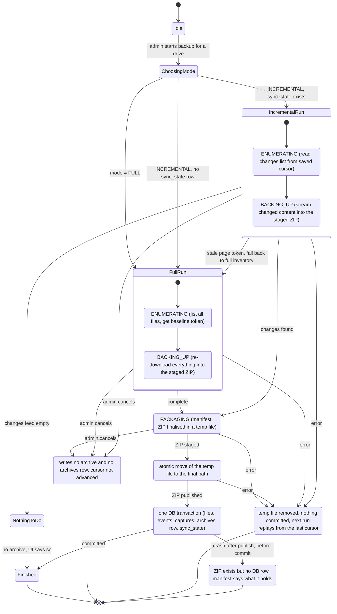
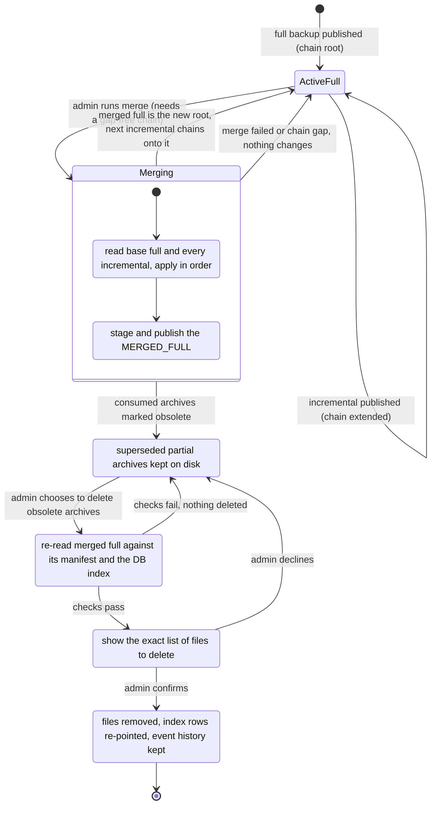

# Google Workspace Drive Backup — Windows Desktop App

## Project overview

A Windows desktop application that backs up **Google Drive data (My Drive + Shared
Drives) for every user in a non-profit Google Workspace organization**, with a
full-plus-incremental archive history and an admin-facing UI to preview and
trigger backups.

The organization runs this periodically against **external hard drives**, not a
paid cloud-backup service — a non-profit budget constraint, not an arbitrary
choice, and one with real consequences (a drive may be unplugged, swapped, or
absent between runs; see Known limitations).

**Programmatic restore is out of scope for this phase** and is planned as a
later initiative. The supported recovery path is manual: a full archive is a
Drive-shaped folder tree the admin can upload directly to a new Drive, trading
away file history for a usable copy (see **Archive output**).

Target stack: **Java + Spring Boot** (backend/service layer), **JavaFX** (UI),
**SQLite** (local state/history), packaged as a native Windows installer via
`jpackage`.

## Implementation progress

Status markers: `[x]` complete, `[-]` in progress, `[ ]` not started.

Last reviewed: 2026-09-19

### Completed

- [x] Spring Boot and JavaFX application startup, including Spring context loading.
- [x] Hexagonal architecture foundations and architecture boundary test.
- [x] Admin OAuth login with browser authorization approval.
- [x] Service-account authentication with domain-wide delegation and user impersonation.
- [x] Workspace user enumeration through the Admin SDK.
- [x] My Drive and Shared Drive listing through the impersonation-backed Drive adapter.
- [x] JavaFX user picker and Drive preview browsing, including folder navigation.
- [x] Focused unit tests and opt-in real-account integration tests for the implemented Google adapters and services.
- [x] Make the user-selection and impersonated Drive-preview flow discoverable and usable in the JavaFX layout.
- [x] Headless initial and incremental sync using `changes.list`. Initial listing persists metadata and downloads versions for non-folder files before saving the start token; incremental sync backs up changed revisions and links them to the current file version. Expired page tokens trigger a full re-inventory without duplicating unchanged versions. Both flows now report per-item progress through `BackupProgressTracker`.
- [x] Detection and persistence of renames, moves, trashing, deletion, and content revision events.
- [x] Versioned local storage writer with `owner/file/revision` paths and sanitized filesystem names. Superseded twice: first by the no-revision-retention decision (the `revision` path segment went away), then by the stream-to-archive decision, which removes the capture store altogether (see **Storage layout** and the **Stream content straight into archives** item under Not started).
- [x] Google-native export handling and the 10MB fallback behavior. Office exports fall back to PDF when the Google export limit is reported.
- [x] Per-drive backup scope selection: let the admin choose which drive(s) — the
  personal drive and/or one or more specific Shared Drives — to include in a
  backup job. The drive list gets a checkbox per row (`CheckBoxListCell`); the
  admin checks the drives to include and clicks **Sync selected drives**.
  Shared Drives synced this way are still deduplicated by `drive_id` via the
  `drives` table. This replaces the previous behavior of automatically
  including every Shared Drive the selected user could see.
- [x] Runtime location selection: let the admin choose and validate **one**
  backup root folder at runtime, applying the choice through
  configuration-backed ports rather than direct UI environment access. The
  backup history database (`backup.db`) always lives inside that root
  alongside the archive output — there is no
  separate database-location picker, so the database can never point
  somewhere other than the archives it describes (see **Backup root
  location**). The location is chosen only in the UI and lasts for the
  current session; every launch starts from `~/.gdrive-backup`. Changes are
  refused while a backup runs. Paths recorded in the database are relative to
  the root (`archives.archive_path` is stored relative to it), so relocating the whole root needs no database changes. This supersedes the earlier two-picker (destination + database)
  implementation.
- [x] Interruptible backups and recovery policy: the admin can cancel a
  running backup from the progress panel. For a single-drive job, Cancel
  stops immediately; for a multi-drive job, it asks the admin to choose
  stop immediately vs. finish the current drive then stop, via a
  `BackupCancellationUseCase` checked cooperatively between files/pages/
  drives (never mid-download, so an in-flight file always finishes). An
  interrupted result is never shown as complete — `BackupResult.cancelled`
  and a "Synchronization cancelled." status replace the completed message.
  Recovery is defined for what exists today (SQLite + the local versioned
  file store; archive packaging doesn't exist yet, so its temp-file/cleanup
  behavior is deferred to that P1 item): a stopped-early full inventory
  never establishes a `sync_state` baseline, so a later run — cancelled and
  retried or not — safely re-lists everything and only re-downloads what
  wasn't already recorded; incremental sync now checkpoints `sync_state`
  after every page of changes, not just the last one, which is also what
  fixes a latent crash-recovery bug where a mid-run crash would replay
  already-applied pages and duplicate `file_events` on retry.
- [x] Progress bar with elapsed and estimated-remaining time: shows current
  operation, elapsed time, and a guessed remaining time for the drive
  currently being synced, resetting as the job moves to the next one. For a
  multi-drive job, also shows which drive is current (by name), how many
  drives the job includes, how many have completed so far, and elapsed/
  estimated-remaining time for the whole job alongside the per-drive figures.
  A `BackupProgressTracker` domain service folds sync events into snapshots
  (indeterminate with a running count for incremental syncs, whose change
  total isn't known until the run ends); the JavaFX layer polls the latest
  snapshot on a timer.
- [x] Store and schema rework for the chain model: local storage under
  `LATEST_ONLY` no longer has a `revision` path segment (`backupRoot/<ownerScope>/<fileId>/<filename>`,
  replaced in place); `file_versions` is replaced by `file_captures` (adding
  a nullable `archive_id`); `file_events` gained a nullable `archive_id`; and
  an `archives` table (`sequence_number`, `base_archive_id`, `mode`,
  `revision_mode`, `cancelled`, cursor range) now exists for the upcoming
  archive writer to populate. `FileVersion`/`FileVersionPort`/`VersionStoragePort`
  were renamed to `FileCapture`/`FileCapturePort`/`CaptureStoragePort`
  throughout. No migration tool exists, so any existing local `backup.db` has
  to be deleted and recreated on next launch.
- [x] Scope type carried explicitly instead of inferred from `@`: a new
  `DriveScope` (`key` plus a `PERSONAL`/`SHARED_DRIVE` type) replaces the bare
  `scopeKey` string on every port and use case that routes on it —
  `DriveFileListingPort`, `DriveChangePort`, `InitialDriveSyncUseCase`,
  `DriveChangeSyncUseCase`, `DriveBackupUseCase` — and on the sync result
  records (`BackupResult`, `InitialSyncResult`, `SyncResult`).
  `GoogleDriveAdapter` now branches on `scope.type()` instead of
  `!scopeKey.contains("@")`, and the JavaFX summary label does the same
  instead of checking for `@` itself. `SyncStatePort`/`SyncState` stay keyed
  by the raw string, since persistence there doesn't branch on scope type.
- [x] SQLite schema and persistence for users, drives, files, captures, events, archives, and sync state. Schema initialization and all metadata/history repositories are in place, including `ArchivePort`/`SqliteArchiveAdapter`, and sync orchestration now writes to `archives` as part of each run.
- [x] Backup options and per-drive archive packaging: the admin picks full versus incremental mode in the UI before starting a sync; `INCREMENTAL` falls back to a full inventory when no baseline exists yet or the saved cursor has expired, and `FULL` always re-inventories regardless of any saved cursor. Each scope's sync run produces its ZIP archive (unless it was cancelled): a full run materializes the live, non-trashed files into a real Drive-shaped folder tree (`FlatTreePathResolver`, with multi-parent flattening, collision suffixing, and a depth/cycle-safe walk of the id-based parent chains); an incremental run writes an id-keyed delta of the run's captured content plus its events, or produces no archive at all when nothing changed. `LocalArchiveSessionAdapter` stages each ZIP to a temp file and atomically publishes it, embedding `manifest.json` (Gson, adapter-side only) before the run's database effects are committed, so a crash never leaves a DB row pointing at a missing file. Only `LATEST_ONLY` revision mode is implemented; history lives in the archive chain instead of a stack of local copies.

- [x] Stream content straight into archives (slice 1): there is no capture
  store any more. `FileContentStreamingService` streams Drive content into an
  `ArchiveSession` (`LocalArchiveSessionAdapter`: temp ZIP, manifest last,
  atomic publish, discard on close). A full run always re-downloads every live
  file into a Drive-shaped tree and fetches its baseline page token before
  listing; an incremental run drains the change feed in memory and then streams
  the changed content as `content/<fileId>`. Database effects are buffered in a
  `PendingCommit` and applied by `SqliteSyncCommitAdapter` in one transaction
  after the ZIP is published (cancelled or failed runs write nothing, and there
  is no per-page cursor checkpoint). `file_captures` is now an archive content
  index (`archive_id` and `entry_name`, no `local_path`) and `file_events.archive_id`
  is always set. Existing `backup.db` files must be deleted (no migration tool).

### In progress

- [-] Continue exposing the remaining backend capabilities through the UI.
- [-] Backup trigger, progress reporting, and partial-failure handling. The UI selects initial or incremental synchronization for the selected user and shows a live progress bar with current-operation status and elapsed/estimated-remaining time (per drive and, for a multi-drive job, for the whole job), then reports the number of inventoried files or processed changes per selected drive on completion. The admin can cancel a running job (see the interruptible-backups item above). If any one scope fails the whole run stops. An org-wide sweep across every Workspace user and partial-failure handling with a completion summary remain.

### Not started

- [ ] **Stream content straight into archives, remaining slices (P1).** The
  streaming session, buffered commit and from-scratch full are done (see
  Completed). Still to do: (2) self-describing manifests — each delta records
  `name`, `parents`, `mime_type`, `trashed` (and the export mime type) for
  every file it touched, and a full manifest does the same for every live file
  and folder, so the tree can be rebuilt from the archives alone; (3) the merge
  engine that builds a full archive from a base full plus every incremental
  without touching Drive or `backup.db` file metadata (adds `archive_sources`).
  Google-native files report no `headRevisionId`, so their Drive `version`
  (recorded as `v<version>`) stands in as the content revision; Forms,
  shortcuts and other native types with no export are recorded as metadata
  only. `version` also moves on metadata-only edits, so a rename of a Doc can
  re-export it and log a `content` event alongside the `rename`.
- [ ] Archive operations (manual, per drive, from the Archive manager): the
  **merge** operation (base full plus all current incrementals into one
  `MERGED_FULL`, which becomes the chain's new root so incremental backups
  continue after it) with an optional, verified and confirmed deletion of the
  superseded partial archives, plus chain-gap detection and starting a new
  chain when a from-scratch full backup runs on a scope that already has one
  (today's `sequence_number` is monotonic per scope, not per chain). Merge
  reads only archives, never Drive. See **Archive operations** under Core
  requirements.
- [ ] History view for file events and captures.
- [ ] Scheduled unattended backups.
- [ ] Windows packaging with `jpackage` and clean-machine verification.
- [ ] Low-priority authenticated-screen UX analysis and a three-column layout for user, Drive, and quota/report information.

This section is the working roadmap. Update the status markers and the
`Last reviewed` date as each vertical slice is completed; keep the detailed
requirements below as the source of truth for expected behavior.

### Approved prioritization

**P0 — required for a usable and safe v1**

- [x] Runtime backup root location selection (database and archives share one root).
- [x] Full versus incremental backup selection.
- [x] Per-drive backup scope selection (personal drive and/or specific Shared
  Drives), replacing automatic inclusion of every visible Shared Drive.
- [x] Interruptible backups with defined database and archive recovery behavior
  (archive recovery deferred to the P1 archive-packaging item, since no
  archive writer exists yet).
- [x] Progress bar with concise current-operation status, elapsed time, and
  estimated remaining time.

**P1 — complete the backup product**

- [x] Per-drive archive output, each with its own manifest: a flat, directly
  uploadable tree for a full run, an id-keyed delta for an incremental one,
  none when an incremental run finds no changes. Each archive is a ZIP file
  with its manifest embedded at the root; a cancelled run writes no archive
  and no chain entry. `sequence_number` is currently monotonic per scope
  rather than per chain, since nothing tracks separate chains yet — starting
  a genuinely new chain on a fresh full backup is still open, see the archive
  operations item below.
- [-] Stream content straight into archives, with no capture store: a full
  archive is always built from scratch by streaming every file from Drive (done);
  it can alternatively be built from a complete set of incremental archives
  (base full plus every delta) (not started). See **Storage layout**.
- Archive operations: the **merge** operation — a `MERGED_FULL` built from the
  base full plus all current incrementals, which becomes the chain's new root
  so incremental backups continue after it — with an option to delete the
  superseded partial archives. Manual, per drive, reads only archives, and
  refuses to run on a chain with a missing link.
- Chain-gap detection and warnings, since deleting an archive now permanently
  destroys the history it held.
- Partial-failure handling and a completion summary for organization-wide runs.

**P2 — operational improvements**

- History view.
- Scheduled unattended backups.

**P3 — delivery and UX refinements**

- Authenticated-screen three-column layout redesign.
- Windows installer and clean-machine verification.

Implementation sequence: runtime location selection; backup-job options and
state; drive scope selection; progress/cancellation/recovery; per-drive archive
packaging; partial-failure summary and history; scheduling; UI redesign and
Windows packaging.

---

## Core requirements (confirmed)

- **Scope**: back up Drive data for *every user in the organization*, not just one
  account — requires admin-level access.
- **Drive selection**: the admin chooses which drive(s) a backup job covers —
  the user's personal drive, one or more specific Shared Drives, or a
  combination — rather than a job always covering every drive automatically.
  The selection applies to the backup job and must be visible before it starts.
- **Google-native files** (Docs/Sheets/Slides): exported to Office formats
  (`.docx` / `.xlsx` / `.pptx`), not kept in native Google format.
- **Storage**: local disk only — specifically **external hard drives** connected
  to the admin's machine, not NAS or cloud, driven by the non-profit
  organization's budget (no NAS/cloud target for v1).
- **Backup root location**: the admin chooses **one** local destination folder
  at runtime — `backupRoot` — that is the root for everything the app writes:
  the SQLite database (`backupRoot/backup.db`), the archive output
  (`backupRoot/archives/...`), and nothing else — content is never staged
  as loose files or folders (see **Storage layout**). There is no separate database-location
  picker; the database always lives inside the chosen root, so the chain
  metadata and the archives it describes can never be pointed at different
  places by the UI. The application validates that the root is writable and
  makes clear when switching roots selects a different backup history.
  Keeping the root intact as a single unit — e.g. when copying or moving it to
  a different folder or drive — **is the administrator's responsibility**: the
  app does not detect or warn if the database and the archives it references
  are later pulled apart (for example, by moving only part of the tree), and
  paths recorded in the database are stored **relative to `backupRoot`**
  precisely so that moving the whole root elsewhere needs no database changes.
- **Revision mode is fixed per chain, and only one mode is built.** Every scope
  (a personal drive or a Shared Drive) has its own **backup chain**: an ordered
  sequence of archives rooted in one full backup, followed by zero or more
  incremental backups and any merged archives produced later. A chain's
  revision mode — `LATEST_ONLY` or a future `ALL_REVISIONS` — is chosen once,
  when the chain's full backup runs, and fixed for every archive added to that
  chain afterward. **`LATEST_ONLY` is the only mode implemented**: it never
  calls Drive's `revisions.list`, and each archive holds exactly the current
  content of the files it carries. There is no admin-facing
  revision-mode picker yet — `revision_mode` already exists on the `archives`
  row so `ALL_REVISIONS` can be added later without reshaping the schema or
  restarting chains, but building it needs separate Google API/design
  validation (see Known limitations). `head_revision_id` is the change
  detector either way, deciding whether a file's content needs re-downloading.
  Starting a **new** full backup on a scope that already has a chain begins a
  **new chain** — the old one is left in place, untouched, just no longer
  extended; this is also the only way a scope would ever move to a different
  revision mode. File history under `LATEST_ONLY` lives entirely in the
  **archive chain**; the app keeps no local copy of file content outside the
  archives themselves.
- **Archive output**: each completed backup job delivers archive output **per
  selected drive** — a personal drive and each Shared Drive get their own
  archive and manifest, never a single archive combining several drives. What
  an archive contains depends on the backup mode:
  - A **full** run produces a complete, self-contained archive shaped like the
    original Drive: real folder hierarchy, real filenames, so the admin can
    upload it straight into a new Drive. A full archive is **always built from
    scratch**: the run re-lists the scope, resolves the folder tree from the
    listed metadata, and streams every live file's content from Drive
    directly into the ZIP — a full run never reuses previously downloaded
    content, so it re-downloads the whole scope each time (an accepted cost in
    API quota and time). A full archive can **also be built from a complete
    set of incremental archives** for the scope — its base full archive plus
    every delta after it, with no gap — by applying each delta's content and
    events in order, without contacting Google (the **merge** operation; see
    **Archive operations**).
  - An **incremental** run produces a **delta** archive: an id-keyed payload of
    the content that changed, streamed from Drive straight into the ZIP as
    it is fetched, plus a manifest of that run's events (rename,
    move, trash, untrash, delete). Deltas are consumed by the merge operations
    rather than browsed, so they are deliberately not Drive-shaped — a partial
    tree could not be uploaded anyway, and a moved file's new path would lose
    where it came from. A rename with no new content still counts as a change
    and still produces a delta archive.
  - **Self-describing deltas.** Each delta's manifest records, for **every file
    the run touched** (new content, rename, move, trash, untrash or delete),
    the file's resulting `name`, `parents`, `mime_type` and `trashed` state, plus
    its `file_id`, revision and entry name when content is included. Content
    entries stay id-keyed, but the manifest alone is enough to place every
    file in the folder tree. This is what lets the merge rebuild the Drive-shaped
    tree from the archives alone, with `backup.db` lost or untrusted. The full
    archive's manifest likewise records name, parents and mime type for every
    live file **and every folder** (folders are needed to resolve ancestor names
    and are not otherwise present in the ZIP).
  - An incremental run whose changes feed returned nothing produces **no
    archive at all**, and the UI says so explicitly rather than presenting a
    completed backup whose archive is missing.

  Only a full archive is self-contained: a delta is usable only alongside the
  full archive it descends from and every delta in between, so the chain is
  tracked in SQLite (`archives`) as the source of truth and mirrored in each
  archive's own manifest, letting an archive be checked and trusted without the
  database. Each archive records its `sequence_number` within its chain, and
  archive filenames include it so related archives are identifiable at a
  glance. **Decided:** each archive is a single ZIP file (native Explorer
  support on Windows, easy to move to an external drive as one unit); its
  manifest is a JSON file embedded at the ZIP's root (e.g. `manifest.json`)
  rather than a sidecar file, so it can never be separated from the archive it
  describes. The full naming convention and directory layout are in
  **Archive layout and naming** under **Local storage layout**.
- **Flat-tree rules**: because a full archive is meant to be re-uploaded, it
  follows filesystem rules rather than Drive's:
  - **Live files only.** Trashed-but-undeleted files are recorded in the
    database and carried in delta archives, but never placed in the tree —
    re-uploading them would reinstate deleted content as if it were live.
  - **Real names preserved.** Only characters genuinely illegal on Windows
    (`\ / : * ? " < > |`) are replaced, so accented and non-Latin filenames
    survive intact (the earlier capture store's stricter `[a-zA-Z0-9._@-]`
    sanitizer must not be reused here).
  - **Collisions disambiguated.** Drive allows two files with the same name in
    one folder; a filesystem does not. Same-name siblings get a ` (2)`, ` (3)`
    suffix.
- **Archive operations**: there is one operation, **merge**, which the admin
  runs manually per drive from the Archive manager without re-contacting
  Google. The intended strategy is to run **frequent incremental backups** and
  periodically **create a full checkpoint from them**, which avoids
  re-downloading the whole Drive; a from-scratch full backup from Drive stays
  available as the recovery choice when incremental archives are lost or
  corrupted. The database is available during the operation, but the
  **archives are authoritative** — their contents and manifests drive the
  work, while the database locates the chain, confirms no link is missing, and
  records the result.
  - **Merge operation**: creates a **full backup from a set of incremental
    archives** — the drive's current base full plus **all** its current
    incrementals (no range selection), applying each delta's content and
    events in order — as a flat, directly-uploadable `MERGED_FULL` archive. It
    refuses to run on a chain with a missing link, reporting which archive is
    absent. The merge needs **only the archives**: file names and parents come
    from the manifests (see **Self-describing deltas**), and the tree is
    resolved with the same flat-tree rules as a from-scratch full. The result
    is a complete archive: extract it and the resulting folder tree can be
    copied or uploaded to a new drive as it stands. The same limits as any full
    archive apply (Google-native files are exported to Office/PDF; sharing,
    permissions, comments and version history are not carried).
  - **Incremental backups continue after a merge.** The merged full becomes the
    chain's **new root**: its state equals the last merged incremental, its
    `to_page_token` is that incremental's `to_page_token`, and the next
    incremental backup chains onto it (`base_archive_id` = the merged full).
    The `sync_state` cursor is untouched by a merge, so the next incremental
    picks up exactly where the last one ended.
  - **Superseded partial archives.** After a merge, the previous base full and
    the incrementals it consumed are **obsolete**: their content is fully
    carried by the merged full, and they are no longer part of the active
    chain. The merge itself deletes nothing — they stay on disk as an older,
    no-longer-extended chain (so the admin holds two equivalent backups of that
    state) until the admin chooses the **option to delete the obsolete partial
    archives**, either as part of the merge or later from the Archive manager.
  - **Verification and confirmation.** Archives are the only copy of the data,
    so before anything is deleted the app re-reads the new merged full and
    checks its entries and sizes against its own manifest and the database
    index, then shows the admin the exact list of obsolete archives about to be
    deleted, and deletes only after explicit confirmation.
  - The merged archive records the archives it was built from — in its
    manifest and in the database (`archive_sources`) — so the relationship is
    checkable without opening the sources.
- **Backup mode**: the admin chooses a full backup or an incremental backup.
  A full backup inventories the selected scope regardless of its change cursor
  and archives it in full; an incremental backup uses the saved `changes.list`
  cursor and archives only that run's changes. See **Archive output** for what
  each mode's archive contains.
- **Progress feedback**: while a backup is running, the UI shows a progress bar
  and a concise status message describing the current operation (for example,
  enumerating files, downloading content, packaging the archive, or completing
  a scope), scoped to the **drive currently being synced** — the fraction shown
  reflects that drive's own progress, not a blended figure across every
  selected drive. Progress resets as the job moves to the next drive.
- **Multi-drive job status**: when a job covers more than one selected drive,
  the UI shows, distinct from the per-drive progress bar above:
  - **which drive is current**, identified by name (e.g. "Shared: Finance" or
    "My Drive"), not just a position in the list;
  - **how many drives this job includes** in total;
  - **how many of them have completed** so far.
  For example: "Shared: Finance — drive 2 of 3, 1 completed."
- **Elapsed and remaining time**: alongside the progress bar, the UI shows
  elapsed time and an estimated time remaining at **both levels**: for the
  drive currently being synced, and for the job as a whole (all selected
  drives combined). For a single-drive job the two coincide and only need
  showing once; for a multi-drive job both are shown together, e.g. "this
  drive: 1m elapsed, ~2m left — whole job: 4m elapsed, ~7m left." How each
  estimate is computed needs a design decision — the per-drive one might
  extrapolate from files or bytes processed so far against the totals known
  from enumeration; the job-level one additionally has to account for
  already-completed drives and however many remain (e.g. an average
  per-drive duration once at least one has finished). Both will necessarily
  be rough guesses, especially early in a drive's sync, right after
  switching from enumeration to download, or before any drive in the job
  has completed yet.
- **Interruptible backups**: the admin can cancel a running backup, visible
  and reachable from the same progress display.
  - For a single-drive job, cancelling stops that drive's sync; the
    interrupted result must never be presented as a completed backup.
  - For a job with **multiple selected drives**, cancelling asks the admin to
    choose between stopping immediately (abandoning the drive in progress
    too) or stopping after the current drive finishes (letting it complete
    normally, then not starting the next selected drive).
  - Either way, cancellation must leave the database and archive output in a
    defined, recoverable state.
- **Admin UI**: lets the admin log in via OAuth (as an access gate) and browse
  both personal (My Drive) and Shared Drives, per org user, as a **preview**
  before running a backup. The UI does not need per-user self-service access —
  admin-only.
- Should also track **renames, moves, trashing, and deletion** of files over
  time, not just content changes.
- **Restore**: programmatic restore is explicitly out of scope for this phase;
  re-uploading a flat full archive is the supported manual path under
  `LATEST_ONLY`. A later initiative once backup itself is solid — including how
  a future `ALL_REVISIONS` archive (full or incremental) would get turned back
  into usable files, which is undesigned for now.

---

## Auth model — two paths, one purpose each

### 1. Service account with domain-wide delegation (backend engine)

This is what actually performs the org-wide backup sweep.

- Created by a Workspace admin in Google Cloud Console; authorized for
  domain-wide delegation in the Admin Console.
- Required scopes:
  - `https://www.googleapis.com/auth/drive.readonly`
  - `https://www.googleapis.com/auth/admin.directory.user.readonly`
- For each org user, impersonate via
  `ServiceAccountCredentials.createDelegated(userEmail)` (from
  `google-auth-library-oauth2-http`) to act as that user and read their My
  Drive + the Shared Drives they can see.
- The service account JSON key is highly sensitive — restrict file
  permissions; consider encrypting at rest (e.g. Jasypt).

### 2. OAuth login (admin UI access gate + preview)

- Standard installed-app OAuth flow (loopback redirect), scope
  `drive.readonly`.
- Purpose is **narrow**: sign in to unlock the admin UI. It is *not* the data
  path for previewing other users' files.
- The actual "preview a user's Drive" feature reuses the **service account +
  impersonation** path (pick an org user → impersonate → browse) so there's
  only one Drive-fetching code path shared between backend sweep and UI
  preview.
- Store the admin's OAuth token in Windows Credential Manager (e.g. via
  `com.microsoft.credentialstorage` or a JNA wrapper), not a plain file.

---

## Libraries

| Purpose | Library |
|---|---|
| Drive API | `google-api-client`, `google-api-services-drive` (v3) |
| Admin SDK (user enumeration) | `google-api-services-admin-directory` |
| Auth / credentials | `google-auth-library-oauth2-http` (`ServiceAccountCredentials`, `UserCredentials`) |
| OAuth loopback flow | `google-oauth-client-jetty` or a manual local HTTP listener |
| Backoff/retry | `google-http-client`'s `ExponentialBackOff` |
| Local DB | `org.xerial:sqlite-jdbc`, optionally Spring Data JPA on top |
| Scheduling | Spring `@Scheduled`, or Quartz if cron-like flexibility is needed |
| UI | JavaFX (+ `javafx-weaver` for Spring DI into controllers) |
| Credential storage | `com.microsoft.credentialstorage` (Windows Credential Manager) or JNA |
| Logging | SLF4J + Logback |
| Packaging | `jpackage` (JDK 14+), optionally `jlink` for a trimmed runtime |

---

## Data model (SQLite)

```
users
  email (PK), display_name, last_synced_at

drives                      -- Shared Drives (deduped, not per-user)
  drive_id (PK), name, last_synced_at

files
  file_id (PK)
  owner_scope              -- user email OR drive_id
  name
  parents                  -- serialized parent id(s) / path
  drive_id                 -- null if in a user's My Drive
  mime_type
  trashed                  -- boolean
  head_revision_id         -- change detector only; no revision history is kept
  current_version_id       -- FK -> file_captures; the latest capture, i.e. where the
                           -- current content lives (an archive entry, not a local file)

file_captures              -- append-only content index: which archive entry holds each captured revision
  id (PK)
  file_id (FK)
  revision_id              -- the head revision this content was taken from
  timestamp
  archive_id               -- FK -> archives; the archive that carries this content (never null)
  entry_name               -- the entry's path inside that archive's ZIP
  size_bytes

file_events                -- rename / move / trash / delete / content
  id (PK)
  file_id (FK)
  event_type               -- 'rename' | 'move' | 'trash' | 'untrash' | 'delete' | 'content'
  old_value
  new_value
  timestamp
  archive_id                -- FK -> archives; which archive's run recorded this event

sync_state
  scope_key (PK)            -- user email or drive_id
  page_token                -- changes.list startPageToken

archives                   -- one row per archive written; the chain's source of truth
  id (PK)
  scope_key                -- user email or drive_id
  sequence_number          -- ordinal within the chain, for naming/display
  base_archive_id          -- FK -> archives; null for a chain's root, which is a FULL or a
                           -- MERGED_FULL archive; incrementals point at their predecessor
  mode                     -- 'FULL' | 'INCREMENTAL' | 'MERGED_FULL' (result of a merge)
  revision_mode            -- 'LATEST_ONLY' | 'ALL_REVISIONS' (future); fixed for the whole chain
  created_at
  archive_path             -- relative to backupRoot; where the archive was written
  from_page_token          -- cursor range this delta covers; null for a full archive
  to_page_token
  cancelled                -- true if the run that produced this archive was interrupted

archive_sources            -- which archives a merged archive was built from
  archive_id (FK)          -- the MERGED_FULL archive
  source_archive_id (FK)   -- one source archive it consumed (the old base full and/or incrementals)
```

Obsolete archives (those consumed by a merge) remain listed in `archives` with
their `archive_sources` link until deleted. When the admin deletes them, in the
same transaction the `file_captures` rows for content the merged full still
carries are re-pointed at the merged full and its entries, index rows for
superseded revisions that no archive carries any more are removed, and the
`file_events` history rows are kept and re-pointed at the merged full (whose
manifest records the net-effect events it superseded), so the operation history
stays complete.

Each archive's manifest mirrors its `archives` row so the chain can be checked
and trusted from the archive alone (see **Manifest format**; it links to its
base by `sequence_number`, since database ids do not survive a rebuild). The database now lives inside the same
`backupRoot` as the archives (see **Backup root location**), and every stored
path is relative to that root rather than absolute, so relocating the whole
root to a new folder or drive needs no database changes; keeping the root
intact as a unit when doing so is the administrator's responsibility (see
Known limitations).

`file_captures` replaces the earlier `file_versions` table. Since the app keeps
no loose copies of content, it is an **index into the archives**: one row per
captured revision saying which archive and entry hold those bytes, with
`files.current_version_id` pointing at the latest one. Together with
`file_events` (the operation history: rename, move, trash, untrash, delete,
content) and `archives`, the database tracks every delta and every operation
the chain has seen, so it can locate any file's content or any event without
opening every archive. `archive_id` on both tables is therefore always set,
written in the same transaction that inserts the `archives` row. The index is
a locator and verification aid, not a substitute for reading the archives
themselves (see **Archive operations**: merges are archive-authoritative); if
the database is lost, the manifests embedded in the archives rebuild it.

`owner_scope` and `scope_key` both hold either a user's email or a Shared
Drive's `drive_id`. Which of the two it is must be carried explicitly alongside
the key, not inferred from the value's shape — today the Drive adapter and the
storage path both rely on "an email contains `@`, a Drive ID doesn't".

---

## Sync algorithm (per user, per Shared Drive)

1. Load `sync_state.page_token` for this scope. If absent, do an initial full
   listing (`files.list`, `supportsAllDrives=true`,
   `includeItemsFromAllDrives=true`) to seed the `files` table, then call
   `changes.getStartPageToken` to establish a baseline.
2. On subsequent runs, call `changes.list` with the stored `page_token`,
   paging until exhausted, then store the returned `newStartPageToken`.
3. For each change entry, diff against the stored row for that `file_id`:
   - `removed: true` → mark deleted (`file_events`: `delete`). Note: this also
     fires on access revocation, not only true deletion — can't always
     distinguish the two.
   - `file.trashed` flips `false → true` → `file_events`: `trash` (keep the
     captured copy; don't hard-delete data).
   - `file.trashed` flips `true → false` → `file_events`: `untrash`.
   - `name` differs from stored → `file_events`: `rename`.
   - `parents` (or `drive_id`, if moved across Shared Drives) differs →
     `file_events`: `move`.
   - `headRevisionId` differs → stream the file's content (download, or
     export for Google-native files) from Drive straight into the delta ZIP
     being staged, and record a `file_captures` index row pointing at that
     entry once the archive is published. Superseded content survives only in
     whichever earlier archive already carried it.
   - Whatever the change, add the file's resulting `name`, `parents`,
     `mime_type` and `trashed` state (or a `removed` marker) to the delta
     manifest's file list, so the manifest is self-describing (see **Manifest
     format**).
4. Handle a stale/expired `page_token` (e.g. after a long offline period) as
   an explicit error path that falls back to a full resync for that scope,
   rather than failing silently.
5. Shared Drives are synced **once per unique `drive_id`**, not once per user
   who can see them — avoid duplicate storage.
6. **Commit protocol.** Because content lives only in the archive being
   written, a run's database effects — `files` metadata updates, `file_events`,
   `file_captures` index rows, the `archives` row, and the new `sync_state`
   cursor — are held in memory and applied **in one transaction only after the
   archive ZIP has been published** (temp file, then atomic move). The
   sequence is: stage the ZIP, publish it, then commit the database. A crash
   between the last two steps leaves an orphan ZIP (recoverable, and its
   manifest says what it contains), never a database row pointing at a missing
   file, and never an advanced cursor for changes whose content was discarded.
   Consequently `sync_state` is **not** checkpointed per page: an interrupted
   or cancelled run writes nothing and the next run replays the change feed
   from the last committed cursor. A full run likewise commits its metadata
   snapshot and baseline cursor only after its archive is published.

---

## State diagrams

Two views of the same design: how a single **backup run** moves through its
states, and how an **archive** (and its chain) moves through its lifecycle.
The diagrams are Mermaid, rendered by GitHub and the VS Code Markdown preview.

### Backup run (one drive)

The phase names `ENUMERATING`, `BACKING_UP`, `PACKAGING` and `FINISHED` match
`BackupPhase`. The **Committing** state is part of the commit protocol (see
**Sync algorithm**, step 6). Nothing is written to the archive folder or the
database before **Publishing**, so every failure or cancellation state below
leaves the previous committed state untouched.



### Archive and chain lifecycle

An archive row only ever exists for a published ZIP. A merge does not delete
anything: it creates a `MERGED_FULL` that becomes the chain's new root and turns
the archives it consumed into **Obsolete** ones, which stay on disk until the
admin confirms their deletion.



---

## Google-native file export

- Docs → `application/vnd.openxmlformats-officedocument.wordprocessingml.document`
- Sheets → `application/vnd.openxmlformats-officedocument.spreadsheetml.sheet`
- Slides → `application/vnd.openxmlformats-officedocument.presentationml.presentation`
- `files.export` has a **10MB cap per file** — plan a fallback (e.g. PDF
  export, or flag-and-skip with a logged warning) for files that exceed it.

---

## Storage layout

`backupRoot` holds exactly two things: `backup.db` and the `archives/`
subtree. **There is no capture store** — file content is never written to disk
as loose files or as an id-keyed or Drive-shaped folder tree. Content streams
from Drive (or, for a full archive built from deltas, from earlier archives)
directly into the ZIP being written, so the only other thing ever on disk is
the single temp ZIP being staged next to its final location.

- A **full** archive gets its folder tree from the `files` metadata at the
  moment the archive is written: real names, collision suffixes, live files
  only (see **Flat-tree rules**). Building the tree is a pure function of that
  metadata, so it is verified in one place rather than maintained on disk.
- An **incremental** delta carries changed content keyed by file id
  (`content/<fileId>`) plus its events manifest.
- Renames and moves are database and manifest events, never file operations.
- Retention applies to **archives**. The archive chain is the only history and
  the only copy of content; nothing on disk can rebuild a lost archive except
  re-downloading from Drive (for the current state) or a complete surviving
  chain.
- Peak extra disk use during a run is one temp ZIP, on the same volume as the
  final archive so the publishing move stays atomic.

The per-archive manifest identifies its scope (personal drive or a specific
Shared Drive), backup mode, the files it touched (with enough metadata to place
each in the tree) and events, and its position in the archive chain. Its exact
shape is under **Manifest format**.

### Archive layout and naming

Archives live under `backupRoot/archives`. `backupRoot` is also where
`backup.db` lives (see **Backup root location**), so the whole tree — the
database and the archives — is one folder the admin can move as a single
unit:

```
backupRoot/backup.db
backupRoot/archives/<scopeFolder>/archive-<sequenceNumber>-<mode>.zip
```

- `<scopeFolder>` identifies the chain. It uses the **flat-tree** sanitizer
  (only characters illegal on Windows — `\ / : * ? " < > |` — are replaced),
  so folder names stay human-readable:
  - Personal drive: `My Drive (<email>)`, e.g. `My Drive (edoardo@example.com)`
    — the email is required, not optional, since an org-wide admin backs up
    more than one user's personal drive over time.
  - Shared Drive: `<drive name> (<drive_id>)`, e.g. `Finance (0AIJ4kZ...)` —
    the `drive_id` suffix keeps the folder unique and stable even if the
    Shared Drive is later renamed, or another Shared Drive shares its name.
- `<sequenceNumber>` is the archive's `sequence_number`, 4-digit zero-padded
  (`0001`, `0002`, ...) so filenames sort correctly in a plain file browser.
- `<mode>` is the archive's `mode` in kebab-case: `full`, `incremental`,
  `merged-full`.
- Each ZIP embeds its manifest at the root as `manifest.json` (see **Archive
  output**), so the archive can never be separated from the record of what it
  contains.

Example, for a Shared Drive scope with a full backup and two incrementals,
after a **merge** (adds a full that becomes the new chain root; deletes
nothing yet):

```
backupRoot/archives/Finance (0AIJ4kZ...)/archive-0001-full.zip
backupRoot/archives/Finance (0AIJ4kZ...)/archive-0002-incremental.zip
backupRoot/archives/Finance (0AIJ4kZ...)/archive-0003-incremental.zip
backupRoot/archives/Finance (0AIJ4kZ...)/archive-0004-merged-full.zip
```

Then the next incremental backup becomes `0005` and chains onto `0004`. If the
admin also deletes the obsolete partial archives (`0001`–`0003`), after
verification and confirmation, what remains is:

```
backupRoot/archives/Finance (0AIJ4kZ...)/archive-0004-merged-full.zip
backupRoot/archives/Finance (0AIJ4kZ...)/archive-0005-incremental.zip
```

### Manifest format

Every archive embeds `manifest.json` at the ZIP root, written last. It is UTF-8
JSON with snake_case keys. A key whose value would be null is omitted, and
timestamps are ISO-8601 UTC strings. The manifest is the archive's own record:
it must be enough to place every file in the folder tree, to verify the
archive, and to re-link it into its chain, without `backup.db`.

**Top-level fields**

| Key | Meaning |
|---|---|
| `format_version` | Manifest schema version, currently `1`. A reader refuses versions it does not know. |
| `scope_key`, `scope_type` | The drive: a user's email or a Shared Drive's `drive_id`, and `PERSONAL` or `SHARED_DRIVE`. |
| `mode` | `FULL`, `INCREMENTAL` or `MERGED_FULL`. |
| `revision_mode` | `LATEST_ONLY` (the only mode implemented). |
| `sequence_number` | The archive's number within the drive's archive folder; matches the `NNNN` in its filename. |
| `base_sequence_number` | The archive this one chains onto (an incremental's predecessor). Absent for a chain root (`FULL`, `MERGED_FULL`). It is a sequence number, not the database id, because ids do not survive a rebuild of the database from the archives. |
| `created_at` | When the archive was built. |
| `from_page_token`, `to_page_token` | The change-feed range an incremental covers. `to_page_token` on a `MERGED_FULL` is the last merged incremental's. Absent on a from-scratch `FULL`. |
| `source_archives` | `MERGED_FULL` only: the `sequence_number` and filename of every archive it was built from. |
| `files` | One record per file, below. |
| `events` | The run's events, below. Empty for a full. |

**File record** (`files[]`)

| Key | Meaning |
|---|---|
| `file_id` | Drive file id. |
| `removed` | `true` for a file Drive reported as removed; the record then carries only `file_id`. |
| `name` | The file's name in Drive (unsanitized, without any export extension). |
| `parents` | Array of parent ids in Drive's order. The first parent places the file in the tree; the rest are the accepted lossy flattening. |
| `drive_id` | Shared Drive id, when the file is in one. |
| `mime_type` | The file's Drive mime type. |
| `trashed` | Whether the file is in the trash. |
| `revision_id` | The content revision this archive holds: `headRevisionId`, or `v<version>` for a Google-native file. Present only when the archive contains the file's bytes. |
| `entry` | The ZIP entry holding the bytes: the Drive-shaped path in a full (`Docs/Report.docx`), `content/<file_id>` in an incremental. Absent when the archive holds no bytes for the file. |
| `size_bytes` | Size of that entry. |
| `export_mime_type` | For a Google-native file, the format it was exported in (docx, xlsx, pptx, or `application/pdf` after the export-size fallback), which fixes its extension when a merge names it. |

What `files` lists depends on the mode:

- **Full**: every file and folder the listing returned. Folders and files with
  no backable content (Forms, shortcuts) have no `entry`; they are listed so
  ancestor names resolve and nothing is silently dropped.
- **Incremental**: one record per file **touched** by the run, whatever the
  change (new content, rename, move, trash, untrash), carrying its resulting
  metadata. A record has an `entry` only if its content changed in this run. A
  file Drive reported as removed gets a `removed` record.
- **Merged full**: the same shape as a full, describing the merged state.

**Event record** (`events[]`): `file_id`, `event_type` (`rename`, `move`,
`trash`, `untrash`, `delete`, `content`), `old_value`, `new_value`, `timestamp`.

Example, an incremental that renamed a folder's file and updated a Doc:

```json
{
  "format_version": 1,
  "scope_key": "edoardo@example.com",
  "scope_type": "PERSONAL",
  "mode": "INCREMENTAL",
  "revision_mode": "LATEST_ONLY",
  "sequence_number": 2,
  "base_sequence_number": 1,
  "created_at": "2026-09-20T08:15:00Z",
  "from_page_token": "1041",
  "to_page_token": "1077",
  "files": [
    { "file_id": "1AbC", "name": "Budget 2026", "parents": ["0Fold"],
      "mime_type": "application/vnd.google-apps.spreadsheet", "trashed": false,
      "revision_id": "v58", "entry": "content/1AbC", "size_bytes": 20480,
      "export_mime_type": "application/vnd.openxmlformats-officedocument.spreadsheetml.sheet" },
    { "file_id": "1XyZ", "name": "Contract (final).pdf", "parents": ["0Fold"],
      "mime_type": "application/pdf", "trashed": false },
    { "file_id": "1Gone", "removed": true }
  ],
  "events": [
    { "file_id": "1XyZ", "event_type": "rename", "old_value": "Contract.pdf",
      "new_value": "Contract (final).pdf", "timestamp": "2026-09-19T17:02:11Z" },
    { "file_id": "1AbC", "event_type": "content", "old_value": "v57",
      "new_value": "v58", "timestamp": "2026-09-19T17:40:03Z" },
    { "file_id": "1Gone", "event_type": "delete", "timestamp": "2026-09-19T18:00:40Z" }
  ]
}
```

**Folding a chain** (used by the merge, and to rebuild the database from the
archives): read the chain in `sequence_number` order, starting from its root.
For each `file_id`, the **latest record** gives its metadata, and the **latest
record that has an `entry`** gives its content (archive and entry). A
`removed` record deletes the file. Files whose latest record is `trashed` are
kept as metadata but left out of a full's tree. Names for the tree come from
`name` plus the export extension implied by `export_mime_type`, resolved with
the flat-tree rules (first parent, sanitizing, ` (2)` collisions).

---

## UI (JavaFX)

- **Login screen**: "Sign in with Google" (OAuth, admin access gate only).
- **User picker**: list of org users (from Admin SDK enumeration, cached
  locally, refreshed periodically).
- **Drive browser**: `TreeView`/`TableView`, lazy-loaded on folder expand, two
  modes:
  - My Drive for the selected user (`q="'root' in parents"`)
  - Shared Drives the selected user belongs to (`drives.list` →
    `files.list(driveId=..., corpora="drive", includeItemsFromAllDrives=true,
    supportsAllDrives=true)`)
  - Both reuse the same impersonation-backed fetch code as the backend.
- **Backup trigger**: let the admin select which drive(s) to back up (the
  personal drive and/or specific Shared Drives) and the backup mode, then run
  full/incremental sync, show per-user progress, package the per-drive archive
  output for the chosen mode, and surface partial failures (suspended
  accounts, revoked access, etc. are expected at org scale).
- **Archive manager**: list each scope's archive chain in order, showing which
  archive is the full baseline and which deltas follow it, and warn when a link
  is missing. Archives made obsolete by a merge are shown as such (an older,
  no-longer-extended chain). From here the admin manually runs the **merge**
  operation per drive (all current incrementals plus the base into a new full
  that becomes the chain's root, after which incremental backups continue) and
  can choose to delete the obsolete partial archives, with the exact file list
  shown beforehand and a confirmation step before any deletion.
- **History view**: query `file_events` + `file_captures` for a selected file
  to show renames/moves/trashes and when its content was captured over time,
  including which archive holds each capture.
- **Layout follow-up (low priority)**: analyse and redesign the authenticated
  screen as three distinct columns/panels: user information and selection,
  Drive browsing/details, and quota/report details. Keep this separate from
  the backup-progress area so the primary task remains legible.

---

## Build order (suggested)

1. Headless sync core: service-account auth, impersonation, `changes.list`
   loop, SQLite schema, incremental diff logic (rename/move/trash/delete
   detection). Prove this from the command line before touching UI.
2. Google-native export handling + 10MB fallback.
3. Versioned local storage writer.
4. Admin SDK user enumeration.
5. JavaFX shell: login gate, user picker, Drive/Shared-Drive browser (reusing
   step 1's fetch code).
6. Backup options (full/incremental), progress UI,
   archive packaging, and history view.
7. `@Scheduled` job for unattended runs.
8. Low-priority JavaFX layout analysis and three-panel redesign.
9. `jpackage` → Windows installer; test on a clean machine without a
   preinstalled JDK.

---

## Known limitations / open risks to keep in mind

- `removed: true` from `changes.list` conflates true deletion with the
  impersonated user losing access — can't fully distinguish without extra
  Admin SDK checks.
- Stale `page_token` after long downtime forces a full resync for that scope.
- `files.export` 10MB cap needs a defined fallback before it's hit in
  production.
- Domain-wide delegation setup is a manual, one-time Admin Console step and
  can't be automated from within the app — document it as a setup guide for
  the admin.
- Backup destinations are external hard drives, which can be unplugged,
  swapped, or simply absent when a run starts. The app doesn't yet detect
  whether the drive currently mounted at a saved path is the same physical
  drive used previously, or warn before writing to an unexpected one.
- A delta archive cannot restore a drive on its own: it needs the full archive
  it descends from plus every delta in between, in order. The merge operation is
  the reassembly tooling; programmatic restore stays out of scope.
- **The archive chain is the only history and the only copy.** The app keeps no
  local content outside the archives, so deleting or losing an archive
  permanently destroys the states it held — there is no local fallback (only a
  fresh full run from Drive can recreate the *current* state). The app tracks
  the chain and warns about gaps, but cannot recover them.
- **Full archives re-download the whole scope.** Building a full archive from
  scratch streams every file from Drive again, costing API quota and time
  proportional to the Drive's size; building one from a complete set of
  incremental archives avoids this but needs an unbroken chain.
- **No per-page crash resume for incremental runs.** With content staged only
  in a temp ZIP, `sync_state` advances only at commit (see **Sync algorithm**,
  commit protocol), so an interrupted run replays its change feed from the last
  committed cursor instead of resuming mid-feed.
- A flat full archive cannot represent Drive faithfully, and re-uploading one
  loses: files that shared a name in a folder (renamed with a ` (2)` suffix),
  any file that had multiple parents, and Google-native fidelity — an exported
  Doc returns as a `.docx`, not a Doc, unless converted on upload.
- **Decided**: the database and the archives no longer have independent
  locations — `backup.db` lives inside the same `backupRoot` as the archives
  it describes (see **Backup root location**), so they move together whenever
  the admin relocates that one folder. This is a structural guarantee, not an
  enforced one: nothing stops an admin from manually copying `backup.db` out
  on its own or deleting part of the tree, and the app does not detect that
  after the fact — each archive's embedded manifest remains the fallback for
  understanding it without the database, same as before.
- **Decided**: a cancelled run (full or incremental) writes no archive and no
  `archives` row — the run leaves the chain exactly as it was before it
  started. For an incremental run this matters most: a partial delta would be
  worse than none, since the next delta would resume *after* the changes the
  cancelled run dropped, silently losing them for good. Under the commit
  protocol (see **Sync algorithm**), a cancelled run commits no `sync_state`,
  metadata or events at all, so the next run replays from the last committed
  cursor and no Drive changes are lost. The
  archive writer stages output in a temp file/directory and only moves it into
  the chosen backup destination — and only inserts the `archives` row — after
  the run completes without cancellation; on cancellation the temp output is
  discarded. The `archives.cancelled` flag remains for a future case (e.g. a
  partial-full-archive option) but nothing sets it yet, since neither mode
  writes a cancelled archive today.
- Restore for a future `ALL_REVISIONS` archive (full or incremental) is
  undesigned, deferred along with restore generally.
- The internal layout for multiple revisions of one file inside an
  `ALL_REVISIONS` archive — how they're organized and named so a future
  restore can tell them apart — is a placeholder until that mode and restore
  are designed.
- The archive filename convention beyond "includes the chain's
  `sequence_number`" is deferred and needs a human-understandable naming
  scheme.
